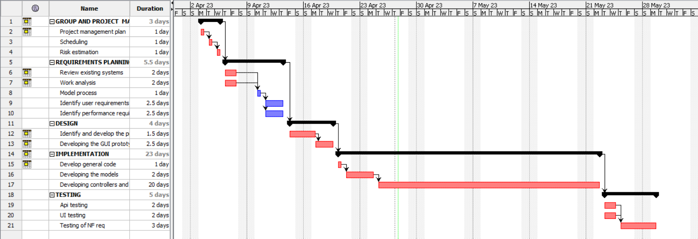

# Project Estimation - FUTURE
Date: 30/03/2023

Version: V2

# Estimation approach
Consider the EZWallet  project in FUTURE version (as proposed by the team), assume that you are going to develop the project INDEPENDENT of the deadlines of the course
# Estimate by size
###             
|             | Estimate                        |             
| ----------- | ------------------------------- |  
| NC =  Estimated number of classes to be developed   |9|             
|  A = Estimated average size per class, in LOC       |150| 
| S = Estimated size of project, in LOC (= NC * A) |1350|
| E = Estimated effort, in person hours (here use productivity 10 LOC per person hour)  |135|   
| C = Estimated cost, in euro (here use 1 person hour cost = 30 euro) |4050| 
| Estimated calendar time, in calendar weeks (Assume team of 4 people, 8 hours per day, 5 days per week ) |2|             

# Estimate by product decomposition
### 
|         component name    | Estimated effort (person hours)   |             
| ----------- | ------------------------------- | 
|requirement document    | 18 |
| GUI prototype | 12 |
|design document | 5  |
|code | 120 |
| unit tests | 12 |
| api tests | 12 |
| management documents  | 4 |

# Estimate by activity decomposition
### 
|         Activity name    | Estimated effort (person hours)   |             
| ----------- | ------------------------------- | 
| GROUP AND PROJECT MANAGEMENT | |
 | Project management plan | 3 |
 | Scheduling | 2 |
 | Risk estimation | 2 |
| REQUIREMENTS PLANNING | |
 | Review existing systems | 4 |
 | Work analysis | 4 |
 | Model process | 2 |
 | Identify user requirements | 8 |
 | Identify performance requirements | 8 |
| DESIGN | |
 | Identify and develop the prototype design | 5 |
 | Developing the GUI prototype | 12 |
| IMPLEMENTATION | |
 | Develop general code | 5 |
 | Developing the models | 6 |
 | Developing the controllers and test code| 110 |
| TESTING | |
 | Api testing | 12 |
 | UI testing | 5 |
 | Testing of NF req | 8 |

###
Insert here Gantt chart with above activities

Please note that the Gantt chart is not done based on a group of 4 people working 8 hours a day for 5 days a week.

# Summary

Report here the results of the three estimation approaches. The  estimates may differ. Discuss here the possible reasons for the difference

|             | Estimated effort                        |   Estimated duration |          
| ----------- | ------------------------------- | ---------------|
| estimate by size |128| 14 days |
| estimate by product decomposition |183 | 37 days|
| estimate by activity decomposition |196 | 41 days|

The reasons why the results given by the three approaches differ from each other could be that the first (by size) uses specifc approximations and is only based on the LOC (lines of code) and so it doesn’t include the parts related to PM, requirements, design, and testing.
The difference in the 2 other approaches could be explained by the fact that the one splitting by activities has a higher level of details with respect to the one based on the one splitting based on products.

