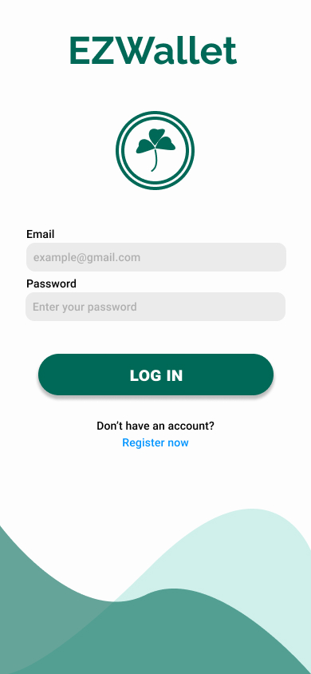
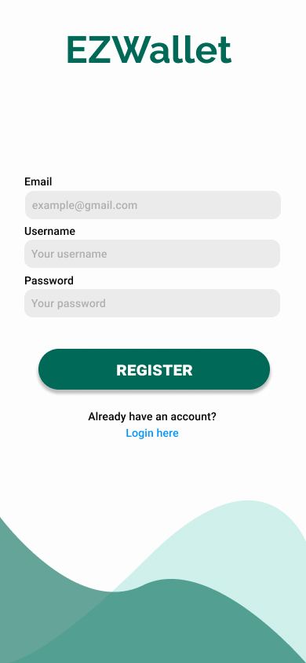
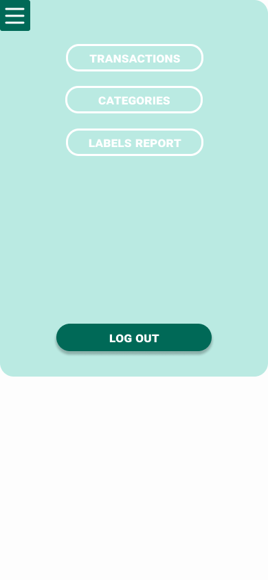

# Graphical User Interface Prototype  - CURRENT

Authors: German Gorodnev

Date: Apr 25, 2023

Version: 1.0.1

<!-- \<Report here the GUI that you propose for EZWallet in CURRENT form, as received by teachers. You are free to organize it as you prefer. A suggested presentation matches the Use cases and scenarios defined in the Requirement document. The GUI can be shown as a sequence of graphical files (jpg, png)  >
 -->

# Application GUI

| Screen | Image |
| ----------------- |:-----------:|
| Login |  |
| Register |  |
| Side menu |  |
| Get transactions |  |
| Create transaction |  |
| Delete transaction |  |
| Get categories |  |
| Create category |  |
| Get labels |  |
