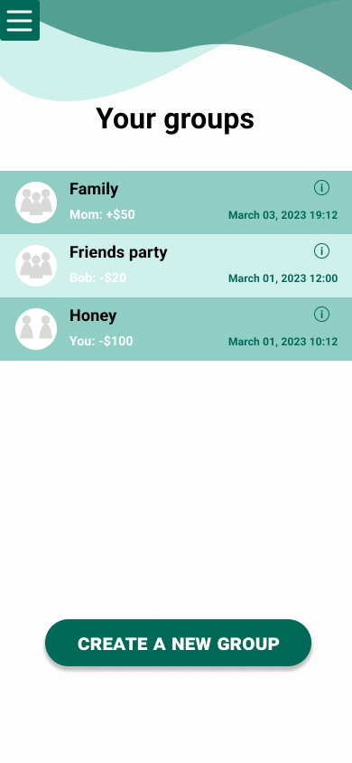
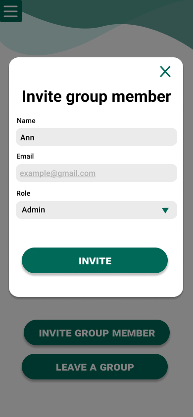
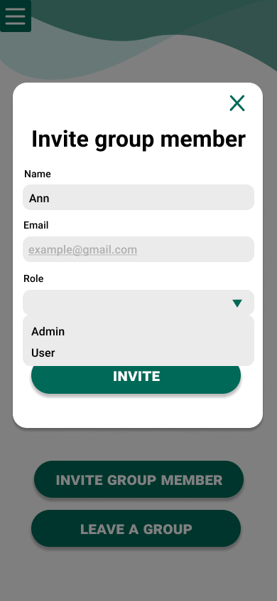

# Graphical User Interface Prototype  - FUTURE

Authors: German Gorodnev

Date: Apr 25, 2023

Version: 1.1.0

<!-- \<Report here the GUI that you propose for EZWallet in FUTURE form, as proposed by the team. You are free to organize it as you prefer. A suggested presentation matches the Use cases and scenarios defined in the Requirement document. The GUI can be shown as a sequence of graphical files (jpg, png)  > -->

# Application GUI

| Screen | Image |
| ----------------- |:-----------:|
| Login |  |
| Register |  |
| Side menu |  |
| Get transactions |  |
| Create transaction |  |
| Create transaction (recurring) |  |
| Delete transaction |  |
| Get categories |  |
| Create category |  |
| Delete category |  |
| Get labels |  |
| Success notification |  |
| Error notification |  |
| Groups |  |
| Create group |  |
| Group info |  |
| Invite member |  |
| Role picker |  |
| Member options |  |
| Transactions in group |  |
| Add group transaction |  |
| Delete group transaction |  |
