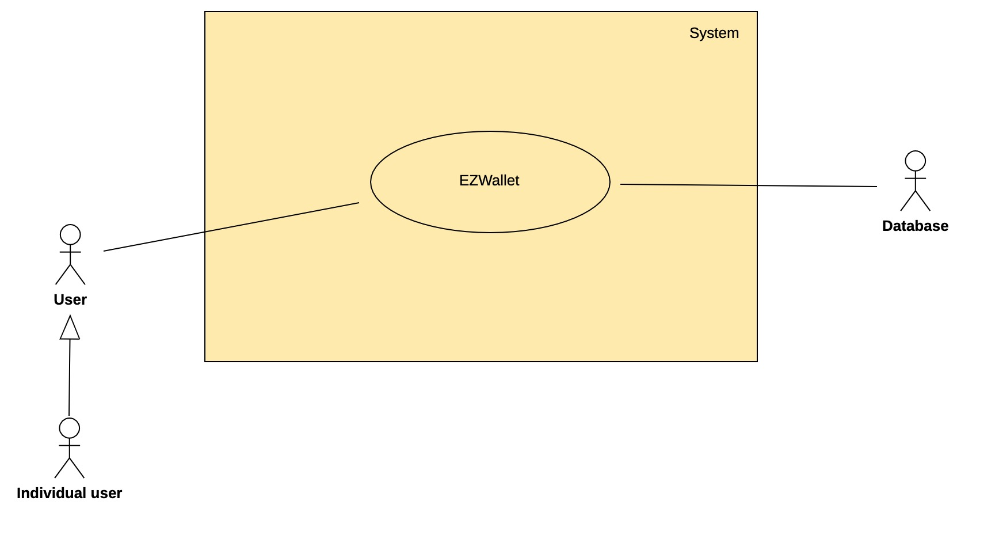
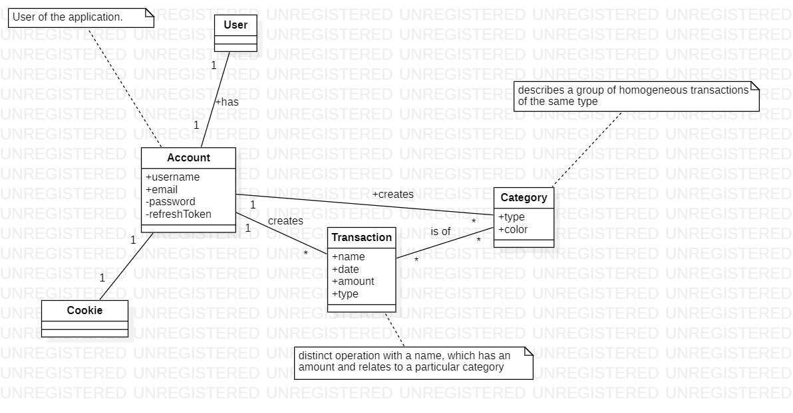
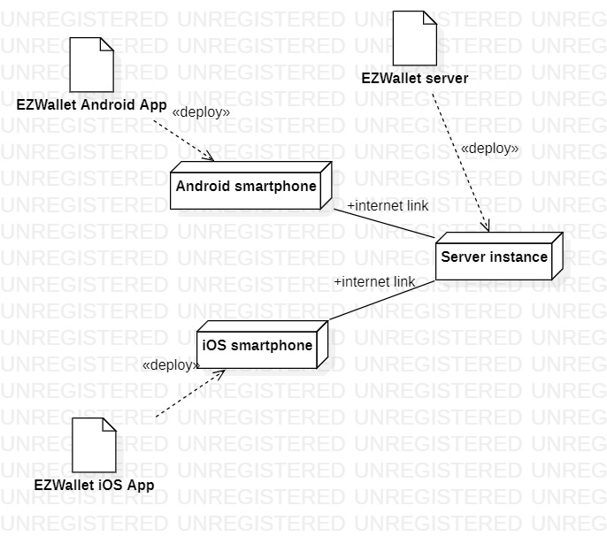

# Requirements Document - current EZWallet

Date: 

Version: V1 - description of EZWallet in CURRENT form (as received by teachers)

 
| Version number | Change |
| ----------------- |:-----------|
| V1.0 | Final version: 28/04/2023 | 

# Contents

- [Requirements Document - current EZWallet](#requirements-document---current-ezwallet)
- [Contents](#contents)
- [Informal description](#informal-description)
- [Business model](#business-model)
- [Stakeholders](#stakeholders)
- [Context Diagram and interfaces](#context-diagram-and-interfaces)
	- [Context Diagram](#context-diagram)
	- [Interfaces](#interfaces)
- [Stories and personas](#stories-and-personas)
	- [Persona 1: Single male/female, 21, low income, maybe student.](#persona-1-single-malefemale-21-low-income-maybe-student)
	- [Persona 2: Single male/female middle age, middle class.](#persona-2-single-malefemale-middle-age-middle-class)
	- [Persona 3: Pensioner, widow, low-income, with children](#persona-3-pensioner-widow-low-income-with-children)
- [Functional and non functional requirements](#functional-and-non-functional-requirements)
	- [Functional Requirements](#functional-requirements)
	- [Non Functional Requirements](#non-functional-requirements)
- [Use case diagram and use cases](#use-case-diagram-and-use-cases)
	- [Use case diagram](#use-case-diagram)
	- [Use cases](#use-cases)
		- [Use case 1 - Register](#use-case-1---register)
				- [Scenario 1.1 - Everything is correct](#scenario-11---everything-is-correct)
				- [Scenario 1.2 - User is already existing](#scenario-12---user-is-already-existing)
		- [Use case 2 - Login](#use-case-2---login)
				- [Scenario 2.1 - Everything is correct](#scenario-21---everything-is-correct)
				- [Scenario 2.2 - Account is not existing](#scenario-22---account-is-not-existing)
				- [Scenario 2.3 - Password is incorrect](#scenario-23---password-is-incorrect)
				- [Scenario 2.4 - already logged in](#scenario-24---already-logged-in)
		- [Use case 3 - Logout](#use-case-3---logout)
				- [Scenario 3.1 - Everything is correct](#scenario-31---everything-is-correct)
				- [Scenario 3.2 - User is already logged out](#scenario-32---user-is-already-logged-out)
				- [Scenario 3.3 - User is invalid](#scenario-33---user-is-invalid)
		- [Use case 4 - Get users](#use-case-4---get-users)
				- [Scenario 4.1 - Everything is correct](#scenario-41---everything-is-correct)
				- [Scenario 4.2 - Error in querying the database](#scenario-42---error-in-querying-the-database)
		- [Use case 5 - Get users by username](#use-case-5---get-users-by-username)
				- [Scenario 5.1 - User details are returned](#scenario-51---user-details-are-returned)
				- [Scenario 5.2 - User is not logged in](#scenario-52---user-is-not-logged-in)
				- [Scenario 5.3 - User is not found](#scenario-53---user-is-not-found)
				- [Scenario 5.4 - User looks for another user](#scenario-54---user-looks-for-another-user)
		- [Use case 6 - Create categories](#use-case-6---create-categories)
				- [Scenario 6.1 - Everything is correct](#scenario-61---everything-is-correct)
				- [Scenario 6.2 - User is not authorized](#scenario-62---user-is-not-authorized)
				- [Scenario 6.3 - Invalid data is entered](#scenario-63---invalid-data-is-entered)
		- [Use case 7 - Get categories](#use-case-7---get-categories)
				- [Scenario 7.1 - Everything is correct](#scenario-71---everything-is-correct)
				- [Scenario 7.2 - User is not authorized](#scenario-72---user-is-not-authorized)
		- [Use case 8 - Create new transaction](#use-case-8---create-new-transaction)
				- [Scenario 8.1 - Everything is correct, no categories added](#scenario-81---everything-is-correct-no-categories-added)
				- [Scenario 8.2 - Everything is correct, category/ies added](#scenario-82---everything-is-correct-categoryies-added)
				- [Scenario 8.3 - User is not authorized](#scenario-83---user-is-not-authorized)
				- [Scenario 8.4 - Name is left out](#scenario-84---name-is-left-out)
				- [Scenario 8.5 - Incorrect amount is entered](#scenario-85---incorrect-amount-is-entered)
		- [Use case 9 - Get transaction](#use-case-9---get-transaction)
				- [Scenario 9.1 - Everything is correct](#scenario-91---everything-is-correct)
				- [Scenario 9.2 - Everything is correct, BUT there are no transactions made, yet](#scenario-92---everything-is-correct-but-there-are-no-transactions-made-yet)
				- [Scenario 9.3 - User is not authorized](#scenario-93---user-is-not-authorized)
		- [Use case 10 - Delete transaction by id](#use-case-10---delete-transaction-by-id)
				- [Scenario 10.1 - Everything is correct](#scenario-101---everything-is-correct)
				- [Scenario 10.2 - User is not authorized](#scenario-102---user-is-not-authorized)
		- [Use case 11 - Get all transactions](#use-case-11---get-all-transactions)
				- [Scenario 11.1 - Everything is correct](#scenario-111---everything-is-correct)
				- [Scenario 11.2 - User is not authorized](#scenario-112---user-is-not-authorized)
				- [Scenario 11.3 - Error while retrieving data](#scenario-113---error-while-retrieving-data)
		- [Use case 12 - Get labeled transactions](#use-case-12---get-labeled-transactions)
				- [Scenario 12.1 - Everything is correct](#scenario-121---everything-is-correct)
				- [Scenario 12.2 - Transaction is bound to non-existing type](#scenario-122---transaction-is-bound-to-non-existing-type)
- [Glossary](#glossary)
- [System Design](#system-design)
- [Deployment Diagram](#deployment-diagram)
- [Defects:](#defects)

# Informal description
EZWallet (read EaSy Wallet) is a software application designed to help individuals and families keep track of their expenses. Users can enter and categorize their expenses, allowing them to quickly see where their money is going. EZWallet is a powerful tool for those looking to take control of their finances and make informed decisions about their spending.

# Business model
The application was taken as an open-source project from the internet

# Stakeholders

| Stakeholder name  | Description | 
| ----------------- |:-----------:|
| Individual user | Single individual using the application |
| EZWallet Developer | Person or group of people in the development team responsible for the development of EZWallet |
| Contributors | They make the strategical decisions about the product, like new feature requests, problems to handle etc. |
| Competitors | Other companies that develop a similar tool. |

# Context Diagram and interfaces

## Context Diagram
<!-- \<Define here Context diagram using UML use case diagram> -->
<!-- \<actors are a subset of stakeholders> -->

## Interfaces
<!-- \<describe here each interface in the context diagram> -->
<!-- \<GUIs will be described graphically in a separate document> -->

| Actor | Logical Interface | Physical Interface  |
| ------------- |:-------------:| -----:|
| Individual user | Graphical User Interface of mobile application (TBD) | Touchscreen, touch |
| Database | Web services | Internet |

# Stories and personas
<!-- \<A Persona is a realistic impersonation of an actor. Define here a few personas and describe in plain text how a persona interacts with the system> -->
<!-- \<Persona is-an-instance-of actor> -->
## Persona 1: Single male/female, 21, low income, maybe student.
- Story: Separated from family and started to live alone. Low income, therefore wants to keep note of expenses and see the report at the end of every month, so she could understand which categories make up the most expenses.
Adds expenses regularly, on a daily basis. Needs the report mostly at the end of the month.
## Persona 2: Single male/female middle age, middle class.
- Story: He/she is focused on their careers and their income. Starting to think about the future, buying a flat and a car, retirement plans, and decide to start tracking expenses. Being familiar with other smartphone applications they understand it quickly and only forget to track something occasionally.
## Persona 3: Pensioner, widow, low-income, with children
- Story: Having a strict income of monthly pension, the pensioner's child decides to show she/he the application. The app can help them keep track of her/his expenses and to be able to plan ahead with her/his income. The child having an insight to his/her parent's financial situation the child can also help them out, in case she/he is in need. 
Since she/he is from an older generation they usually have some problems of logging the expenses correctly, or forgetting to log the expenses.

<!-- \<stories will be formalized later as scenarios in use cases> -->

# Functional and non functional requirements

## Functional Requirements

\<In the form DO SOMETHING, or VERB NOUN, describe high level capabilities of the system>

\<they match to high level use cases>

| ID        | Description  |
| ------------- |:-------------:|
|  FR1     | "register"  |
|  FR1.1   | When the credentials are not equal to others already existing the function "register" is responsible for creating a new account and saving the data in the database. The function should return a status message with code "200" and the message "user added successfully". |
|  FR1.2   | When the credentials are equal to others already existing the function "register" is responsible for returning the status code "400" and displaying the message "you are already registered" on the screen. |
|  FR2     | "login"  |
|  FR2.1   | When the user is already logged in the function "login" is responsible for displaying an error message with the status code "200" and message "you are already logged in" on the screen. |
|  FR2.2   | When the user does not exist the function "login" is responsible for displaying an error message with the status code "400" and message "please you need to register" on the screen. |
|  FR2.3   | When the user uses wrong credentials the function "login" is responsible for displaying an error message with the status code "400" and message "wrong credentials" on the screen. |
|  FR2.4   | When the user inserts the correct credentials the function "login" is responsible for granting access to the application and to handle the token. |
|  FR3     | "logout"  |
|  FR3.1   | When the user is already logged out the function "logout" is responsible for returning an error message with the status code "200" and displaying the message "you are already logged out" on the screen. |
|  FR3.2   | When the user is not found in the database the function "logout" is responsible for returning the status code "200" and displaying the message "user not found" on the screen. |
|  FR3.3   | When the user is correctly logged in the function "logout" is responsible for managing the tokens and to properly executing the log out. The function should return the status code "200" and displaying the message "logged out" on the screen. " |
|  FR4     | "getUsers"  |
|  FR4.1   | The function "getUsers" is responsible for finding all users in the database and returning it with status code "200". |
|  FR5     | "getUserByUsername"  |
|  FR5.1   | When the user's access token or refresh token is invalid (user is NOT Authorized) the function "getUserByUsername" is responsible for returning with status code "401" and displaying the message "Unauthorized" on the screen. It should not complete the request. |
|  FR5.2   | When the requesting user's (who is calling the function) resfeshtoken is not associated to any user in the database it should return the status code "401" and should display the message "User not found" on the screen. |
|  FR5.3   | When the requesting user's (who is calling the function) username is NOT equal to the username that is found in the database with the token sent in the request, the function should return the status code "401" and should display the message "Unauthorized" on the screen. |
|  FR5.4   | When the requesting user's (who is calling the function) username is equal to the username that is found in the database with the refresh token sent in the request, the function should return the status code "200" and should return the found user. |
|  FR6     | "refreshToken"  |
|  FR6.1   | When the user's token is invalid the function "refreshToken" is responsible for returning the status code "401" and displaying the message "Unauthorized" on the screen. | 
|  FR6.2   | When the user's token is valid the function "refreshToken" is responsible for updating the specific token. |
|  FR7     | "create_Categories"  |
|  FR7.1   | When the user's access token is valid (user is authorized), the function "create_Categories" is responsible for creating a new category for the user with a given "type" and "color", saving it in the database and returning the data with the status code "400". |
|  FR7.2   | When the user's accesstoken is invalid the function "create_Categories" is responsible for returning the status code "401" and displaying the message "Unauthorized on the screen. It should not complete request. |
|  FR8     | "get_Categories"  |
|  FR8.1   | When the user's access token is valid (user is authorized), the function "get_Categories" is responsible for finding and listing all categories with their "type" and "color". |
|  FR8.2   | When the user's access token is invalid (user is NOT Authorized) the function "get_Categories" is responsible returning the status code "401" and displaying the message "Unauthorized" on the screen and it should not complete the request. |
|  FR9     | "create_transaction"  |
|  FR9.1   | When the user's access token is is valid (user is authorized), the function "create_transaction" is responsible for saving a new transaction to the database with a given 'name', 'amount', 'type' that are specified by the user and the current 'date'. It should return the status code "400".  |
|  FR9.3   | When the user's access token is invalid (user is NOT Authorized) the function "create_transaction" is responsible for returning the status code "401" with the message "Unauthorized". It should not complete the request. |
|  FR10    | "get_transaction"  |
|  FR10.1  | When the user's accesstoken is valid  (user is authorized), the function "get_transaction" is responsible for finding and returning all transactions. |
|  FR10.2  | When the user's access token is invalid (user is NOT Authorized) the function "get_transaction" is responsible returning the status code "401" and the message "Unauthorized". It should not complete the request. |
|  FR11    | "delete_transaction"  |
|  FR11.1  | When the user accesstoken is valid (user is authorized), the function "delete_transaction" is responsible for deleting a transaction with a given 'ID' that is specified in the body of the request and returning the message "deleted" upon completion. |
|  FR11.2  | When the user's accesstoken is invalid (user is NOT Authorized) the function "delete_transaction" is responsible for returning the status code "401" and the message "Unauthorized". It should not complete the request. |
|  FR12    | "get_labels"  |
|  FR12.1  | When the user's accesstoken is valid (user is Authorized), the function "get_labels" is responsible for finding and listing all transactions with their details from a given optional category. |
|  FR12.2  | When the user's accesstoken is valid (user is Authorized) AND the function is unable to map or assign the request, it is responsible for setting the status to the status code "400". |
|  FR12.3  | When the user's access token is invalid (user is NOT Authorized) the function "get_labels" is responsible for returning the status code "401" and message "Unauthorized". It should not complete the request. |

## Non Functional Requirements

\<Describe constraints on functional requirements>

<!-- e.g. async function to improve performance -->
<!--
	- Usability: effort needed to learn the product
	- Efficiency: response time
	- Correctness capability provide intended functionality
	- reliability: defects visible by end user per time
	- maintainability: effort to fix
	- portability: effort for deploy to another platform
	- Security: protection of malicious access / only to authorized
	- Safety: absence of harm   
-->

| ID        | Type (efficiency, reliability, ..)           | Description  | Refers to |
| ------------- |:-------------:| :-----:| -----:|
|  NFR1     | Efficiency | The functions mentioned in the referenced requirements must work asynchronously to increase efficiency and performance. | FR1-FR11 |
| NFR2 | Reliability | The functions mentioned in the referenced requirements should use a try-catch block to increase reliability. In case of an error they should return the status code "500" and the error message. | FR1, FR2, FR3, FR4, FR5 |
| NFR3 | Security | The functions mentioned in the referenced requirements should use encryption to protect user data. | FR2 |
| NFR3 | Security | The user's password should be hashed. Only the hashed value may be stored in the database. | FR1, FR2 |
| NFR3 | Usability | The application should use an accessToken that stores the user's credentials to ease the use of the application. It should be used to verify the identity of the user to avoid unauthorized accesses to data. The accessToken is valid for 1 hour from creation. When the user is logs out it is destroyed. | FR1-FR12 |
| NFR4 | Usability | The application should use a refreshToken that can be used to create new accessToken to enable continuous usage of the application. | FR1-FR12 |

# Use case diagram and use cases

## Use case diagram
<!-- \<define here UML Use case diagram UCD summarizing all use cases, and their relationships> -->

\<next describe here each use case in the UCD>

<!-- \<describe here scenarios instances of UC1> -->
<!-- \<a scenario is a sequence of steps that corresponds to a particular execution of one use case> -->
<!-- \<a scenario is a more formal description of a story> -->
<!-- \<only relevant scenarios should be described> -->

## Use cases

Note: the database is an actor that is included in every use case, hence we decided to omit putting it to every description.
<!-- USE CASES FOR END USERS -->

### Use case 1 - Register
| Actors Involved        | User |
| ------------- |:-------------:| 
|  Precondition     | User has no account |
|  Post condition     | User has an account  |
|  Nominal Scenario     | New account is created and saved in backend |
|  Variants     |  |
|  Exceptions     | User is already existing |

##### Scenario 1.1 - Everything is correct
| Scenario 1.1 | |
| ------------- |:-------------:| 
|  Precondition     | User has no account |
|  Post condition     | User has an account |
| Step#        | Description  |
|  1     | User asks to register |  
|  2     | System asks username, e-mail, password (user is not already registered) |
|  3     | System hashes the password |
|  4     | System saves the new account |

##### Scenario 1.2 - User is already existing
| Scenario 1.2 | |
| ------------- |:-------------:| 
|  Precondition     | User is already existing |
|  Post condition     | Error message is returned, the account is not created |
| Step#        | Description  |
|  1     | User asks to register |  
|  2     | System asks username, e-mail, password |
|  3     | Request fails with status code "400" |
|  4     | The error message is returned to the user |

### Use case 2 - Login
| Actors Involved        | User |
| ------------- |:-------------:| 
|  Precondition     | User has an account |
|  Post condition     | User is logged in |
|  Nominal Scenario     | Everything is correct |
|  Variants     | |
|  Exceptions     | already logged in, account is not existing, password is incorrect |

##### Scenario 2.1 - Everything is correct
| Scenario 2.1 | |
| ------------- |:-------------:| 
|  Precondition     | User has an account |
|  Post condition     | User is logged in |
| Step#        | Description  |
|  1     | User asks to login |  
|  2     | System asks e-mail, password |
|  3     | User enters e-mail, password |
|  4     | System checks that access token is valid |  
|  5     | System checks that credentials are correct   |
|  6     | System authorizes the user and handles the token |
|  7     | System returns status code "200" |

##### Scenario 2.2 - Account is not existing
| Scenario 2.2 | |
| ------------- |:-------------:| 
|  Precondition     | Entered e-mail is not existing |
|  Post condition     | User is not logged in |
| Step#        | Description  |
|  1     | User asks to login |  
|  2     | System asks e-mail, password |
|  3     | User enters e-mail, password |
|  4     | System checks database, finds no user with the given e-mail address |
|  5     | System returns status code "400" and message 'please you need to register'.  |

##### Scenario 2.3 - Password is incorrect
| Scenario 2.3 | |
| ------------- |:-------------:| 
|  Precondition     | Inserted password is not correct |
|  Post condition     | User is not logged in |
| Step#        | Description  |
|  1     | User asks to login |  
|  2     | System asks e-mail, password |
|  3     | User enters e-mail, password |
|  4     | System checks that credentials, that are not correct |
|  5     | System returns status code "400" and message 'wrong credentials'. |

##### Scenario 2.4 - already logged in
| Scenario 2.4 | |
| ------------- |:-------------:| 
|  Precondition     | User is already logged in |
|  Post condition     | User acknowledges he/she is already authenticated |
| Step#        | Description  |
|  1     | User asks to login |  
|  2     | System asks e-mail, password |
|  3     | User enters e-mail, password |
|  4     | System checks that accessToken is valid | 
|  5     | System returns status code "200" and message 'you are already logged in'. |

### Use case 3 - Logout
| Actors Involved        | User |
| ------------- |:-------------:| 
|  Precondition     | User is logged in |
|  Post condition     | User is logged out  |
|  Nominal Scenario     | User is properly logged out |
|  Variants     |  |
|  Exceptions     | user is already logged out, user is invalid |

##### Scenario 3.1 - Everything is correct
| Scenario 3.1 | |
| ------------- |:-------------:| 
|  Precondition     | User is logged in |
|  Post condition     | User is logged out  |
| Step#        | Description  |
|  1     | User asks system to log out |  
|  2     | System checks token |
|  3     | System checks user's validity |
|  4     | System logs the user out, responds with status code "200" and message 'logged out'. |

##### Scenario 3.2 - User is already logged out
| Scenario 3.2 | |
| ------------- |:-------------:| 
|  Precondition     | User is already logged out |
|  Post condition     | Error message is returned |
| Step#        | Description  |
|  1     | User asks the system to log out |  
|  2     | System checks that token is not valid |
|  3     | Request fails with status code "200" |
|  4     | The message "you are already logged out" is returned |

##### Scenario 3.3 - User is invalid 
| Scenario 3.3 | |
| ------------- |:-------------:| 
|  Precondition     | User is not in the database |
|  Post condition     | Error message is returned |
| Step#        | Description  |
|  1     | User asks the system to log out |  
|  2     | System checks token |
|  3     | System checks user, who is not found in the database |
|  4     | Request fails with status code "400" |
|  5     | The message "user not found" is returned to the user |

### Use case 4 - Get users
| Actors Involved        | User |
| ------------- |:-------------:| 
|  Precondition     | |
|  Post condition     | The list is properly returned  |
|  Nominal Scenario     | The list is retrieved from database |
|  Variants     |  |
|  Exceptions     | error in querying the database |

##### Scenario 4.1 - Everything is correct
| Scenario 4.1 | |
| ------------- |:-------------:| 
|  Precondition     | |
|  Post condition     | The list is properly returned  |
| Step#        | Description  |
|  1     | User asks the system for a list of all users |  
|  2     | System queries the database and retrieves the list |

##### Scenario 4.2 - Error in querying the database
| Scenario 4.2 | |
| ------------- |:-------------:| 
|  Precondition     |  |
|  Post condition     | Error message is returned  |
| Step#        | Description  |
|  1     | User asks the system for a list of all users |  
|  2     | System queries the database and request fails |
|  3     | The status code '500' is returned with the error message |

### Use case 5 - Get users by username
| Actors Involved        | User |
| ------------- |:-------------:| 
|  Precondition     | User is authenticated |
|  Post condition     | The value is properly returned and the user can continue |
|  Nominal Scenario     | User details are returned |
|  Variants     |  |
|  Exceptions     | user is not logged in, user not found, user looks for another user |

##### Scenario 5.1 - User details are returned
| Scenario 5.1 | |
| ------------- |:-------------:| 
|  Precondition     | User is authenticated |
|  Post condition     | The data is properly returned |
| Step#        | Description  |
|  1     | User asks the system for its credentials |  
|  2     | System queries the database (user is found) |
|  3     | System provides the user the specific data |
##### Scenario 5.2 - User is not logged in
| Scenario 5.2 | |
| ------------- |:-------------:| 
|  Precondition     | User is not logged in  |
|  Post condition     | Error message is returned  |
| Step#        | Description  |
|  1     | User asks the system for a specific user |  
|  2     | System queries the database, but the user is logged out |
|  3     | System returns status code "401" and message "unauthorized". |

##### Scenario 5.3 - User is not found
| Scenario 5.3 | |
| ------------- |:-------------:| 
|  Precondition     | User is logged in  |
|  Post condition     | Error message is returned  |
| Step#        | Description  |
|  1     | User asks the system for a specific user |  
|  2     | System queries the database, but the user is not found |
|  3     | System returns status code "401" and message "user not found". |

##### Scenario 5.4 - User looks for another user
| Scenario 5.4 | |
| ------------- |:-------------:| 
|  Precondition     | User is logged in  |
|  Post condition     | Error message is returned  |
| Step#        | Description  |
|  1     | User asks the system for a specific user |  
|  2     | System queries the database, but the user is different from the requesting user |
|  3     | System returns status code "401" and message "unauthorized". |

### Use case 6 - Create categories
| Actors Involved        | User |
| ------------- |:-------------:| 
|  Precondition     | User is authenticated |
|  Post condition     | New category is created and entered into the database  |
|  Nominal Scenario     | New category is created and saved in backend |
|  Variants     | Category is created while entering a transaction OR
category is created separately |
|  Exceptions     | User is not authorized, invalid data is entered |

##### Scenario 6.1 - Everything is correct
| Scenario 6.1 | |
| ------------- |:-------------:| 
|  Precondition     | User is authenticated |
|  Post condition     | New category is created and entered into the database  |
| Step#        | Description  |
|  1     | User touches the "Add new category" button |  
|  2     | User enters the details of the category |
|  2.1   | User enters the type of the category |
|  2.2   | User enters the color of the category |
|  3     | User clicks on "Save" |
|  4     | Category is entered into to user's account on backend |
|  5     | User is navigated back to the main screen |

##### Scenario 6.2 - User is not authorized
| Scenario 6.2 | |
| ------------- |:-------------:| 
|  Precondition     | User is not authorized |
|  Post condition     | Error message is returned, the category is not created |
| Step#        | Description  |
|  1     | User touches the "Add new category" button |  
|  2     | User credentials are fetched from backend |
|  3     | Request fails with status code "401" |
|  4     | The error message is returned to the user |
|  5     | User is navigated back to the main screen |

##### Scenario 6.3 - Invalid data is entered
| Scenario 6.3 | |
| ------------- |:-------------:| 
|  Precondition     | User is authorized |
|  Post condition     | Error message is returned, back to category creation page |
| Step#        | Description  |
|  1     | User touches the "Add new category" button |  
|  2     | User enters the details of the category |
|  2.1   | User DOES NOT enter data correctly |
|  3     | User clicks on "Save" |
|  4     | Request fails with status code "400" |
|  5     | Error message is returned |
|  6     | User is navigated back to the category creation page |

### Use case 7 - Get categories
| Actors Involved        | User |
| ------------- |:-------------:| 
|  Precondition     | User is authenticated |
|  Post condition     | Categories are returned on the screen |
|  Nominal Scenario     | List of existing categories is returned on the screen |
|  Variants     | |
|  Exceptions     | User is not authorized |

##### Scenario 7.1 - Everything is correct
| Scenario 7.1 | |
| ------------- |:-------------:| 
|  Precondition     | User is authenticated |
|  Post condition     | Categories are returned on the screen |
| Step#        | Description  |
|  1     | Navigate to categories tab from side menu |  
|  2     | Fetch categories list from backend |
|  3     | Display categories list |

##### Scenario 7.2 - User is not authorized
| Scenario 7.2 | |
| ------------- |:-------------:| 
|  Precondition     | User is NOT authorized |
|  Post condition     | Error is returned to user |
| Step#        | Description  |
|  1     | Navigate to categories tab from side menu |  
|  2     | Make backend request |
|  3     | Request fails with status 401 |
|  4     | Display error to user |

### Use case 8 - Create new transaction
| Actors Involved        | User |
| ------------- |:-------------:| 
|  Precondition     | User is authenticated, user is on "Transactions" page |
|  Post condition     | New transaction is added to database |
|  Nominal Scenario     | Everything is correct |
|  Variants     | Category/ies added or not |
|  Exceptions     | User is not authorized, Invalid amount, no name entered |

##### Scenario 8.1 - Everything is correct, no categories added
| Scenario 8.1 | |
| ------------- |:-------------:| 
|  Precondition     | User is authenticated, user is on "Transactions" page |
|  Post condition     | New transaction is added to database |
| Step#        | Description  |
|  1     | User clicks "Add transaction" button |  
|  2     | Get transaction info from user |
|  2.1   | User enters name of transaction |
|  2.2   | User enters correct amount of the transaction |
|  3     | Clicks "Save transaction" |
|  4     | Send POST request to backend |
|  5     | Request is executed correctly, new transaction document is returned from backend |
|  6     | Close app screen |

##### Scenario 8.2 - Everything is correct, category/ies added
<!--can there be more than one category added?-->
| Scenario 8.2 | |
| ------------- |:-------------:| 
|  Precondition     | User is authenticated, user is on "Transactions" page |
|  Post condition     | New transaction is added to database |
| Step#        | Description  |
|  1     | User clicks "Add transaction" button |  
|  2     | Get transaction info from user |
|  2.1   | User enters name of transaction |
|  2.2   | User enters correct amount of the transaction |
|  2.3   | User enters category of the transaction |
|  3     | Clicks "Save transaction" |
|  4     | Send POST request to backend |
|  5     | Request is executed correctly, new transaction document is returned from backend |
|  6     | Close app screen |
##### Scenario 8.3 - User is not authorized
| Scenario 8.3 | |
| ------------- |:-------------:| 
|  Precondition     | User is NOT authorized |
|  Post condition     | Error is returned to user |
| Step#        | Description  |
|  1     | User clicks "Add transaction" button |  
|  2     | Get transaction info from user |
|  3     | Clicks "Save transaction" |
|  4     | Send POST request to backend |
|  5     | Request fails with status 401 |
|  6     | Error is returned to user |

##### Scenario 8.4 - Name is left out
| Scenario 8.4 | |
| ------------- |:-------------:| 
|  Precondition     | User is authenticated, user is on "Transactions" page |
|  Post condition     | Error is returned to the user |
| Step#        | Description  |
|  1     | User clicks "Add transaction" button |  
|  2     | Get transaction info from user |
|  2.1   | User DOES NOT enter the name of transaction |
|  3     | Clicks "Save transaction" |
|  4     | Send POST request to backend |
|  5     | Request fails due to missing transaction name |
|  6     | Error is returned to the user |

##### Scenario 8.5 - Incorrect amount is entered
| Scenario 8.5 | |
| ------------- |:-------------:| 
|  Precondition     | User is authenticated, user is on "Transactions" page |
|  Post condition     | Error is returned to the user |
| Step#        | Description  |
|  1     | User clicks "Add transaction" button |  
|  2     | Get transaction info from user |
|  2.1   | User enters INCORRECT amount for the transaction (0 or EMPTY) |
|  3     | Clicks "Save transaction" |
|  4     | Send POST request to backend |
|  5     | Request fails due to incorrect transaction amount |
|  6     | Error is returned to the user |

### Use case 9 - Get transaction
| Actors Involved        | User |
| ------------- |:-------------:| 
|  Precondition     | User is authenticated |
|  Post condition     | List of transactions is returned to user  |
|  Nominal Scenario     | User clicks on transactions tab, GET request is executed successfully, user sees transactions list |
|  Variants     | None |
|  Exceptions     | User is not authorized |
##### Scenario 9.1 - Everything is correct
| Scenario 9.1 | |
| ------------- |:-------------:| 
|  Precondition     | User is authenticated |
|  Post condition     | List of transactions is returned to user  |
| Step#        | Description  |
|  1     | Navigate to transactions tab from side menu |  
|  2     | Fetch transactions list from backend |
|  3     | Display transactions list |

##### Scenario 9.2 - Everything is correct, BUT there are no transactions made, yet
| Scenario 9.2 | |
| ------------- |:-------------:| 
|  Precondition     | User is authenticated |
|  Post condition     | Information is returned to user |
| Step#        | Description  |
|  1     | Navigate to transactions tab from side menu |  
|  2     | Fetch transactions list from backend |
|  3     | There are no transactions made, yet |
|  4     | Display information that there are no transactions made, yet |

##### Scenario 9.3 - User is not authorized
| Scenario 9.3 | |
| ------------- |:-------------:| 
|  Precondition     | User is NOT authorized |
|  Post condition     | Error is returned to user |
| Step#        | Description  |
|  1     | Navigate to transactions tab from side menu |  
|  2     | Make backend request |
|  3     | Request fails with status 401 |
|  4     | Display error to user |

### Use case 10 - Delete transaction by id
| Actors Involved        | User |
| ------------- |:-------------:| 
|  Precondition     | User is authenticated, user is on "Transactions" page |
|  Post condition     | Transaction is removed from database and from user's screen |
|  Nominal Scenario     | Everything is correct |
|  Variants     | |
|  Exceptions     | User is not authorized |

##### Scenario 10.1 - Everything is correct
| Scenario 10.1 | |
| ------------- |:-------------:| 
|  Precondition     | User is authenticated, user is on "Transactions" page |
|  Post condition     | Transaction is removed from database and from user's screen |
| Step#        | Description  |
|  1     | Click delete button |
|  2     | Send request to backend with transaction id |
|  3     | Delete transaction from database by id |
|  4     | Finish request with status 200 and response "deleted" |
|  5     | Transaction is removed from app screen |

##### Scenario 10.2 - User is not authorized
| Scenario 10.2 | |
| ------------- |:-------------:| 
|  Precondition     | User is NOT authorized |
|  Post condition     | Error is returned to user |
| Step#        | Description  |
|  1     | Click delete button |
|  2     | Send request to backend with transaction id |
|  3     | Delete transaction from database by id | 
|  4     | Request fails with status 401 |
|  5     | Error is returned to user |

### Use case 11 - Get all transactions
<!-- is this implemented by the get labels function? -->
| Actors Involved        | User |
| ------------- |:-------------:| 
|  Precondition     | User is authenticated, user is on "Transactions" page |
|  Post condition     | All transactions are returned |
|  Nominal Scenario     | Everything is correct |
|  Variants     | |
|  Exceptions     | User is not authorized |

##### Scenario 11.1 - Everything is correct
| Scenario 11.1 | |
| ------------- |:-------------:| 
|  Precondition     | User is authenticated, user is on "Transactions" page |
|  Post condition     | All transactions are returned |
| Step#        | Description  |
|  1     | Navigate to transactions tab from side menu |  
|  2     | Fetch transactions list from backend |
|  3     | Display transactions list |

##### Scenario 11.2 - User is not authorized
| Scenario 11.2 | |
| ------------- |:-------------:| 
|  Precondition     | User is NOT authorized |
|  Post condition     | Error is returned to user |
| Step#        | Description  |
|  1     | Navigate to transactions tab from side menu |  
|  2     | Fetch transactions list from backend |
|  3     | Request fails with status 401 |
|  4     | Error is returned to user |

##### Scenario 11.3 - Error while retrieving data
| Scenario 11.3 | |
| ------------- |:-------------:| 
|  Precondition     | User is authenticated, user is on "Transactions" page |
|  Post condition     | Error message is returned |
| Step#        | Description  |
|  1     | Navigate to transactions tab from side menu |  
|  2     | Fetch transactions list from backend |
|  3     | Object assignment or mapping fails with status 400 |
|  4     | Error is returned to user |

### Use case 12 - Get labeled transactions
| Actors Involved        | User |
| ------------- |:-------------:| 
|  Precondition     | User is authenticated |
|  Post condition     | List of categories with total spending is shown to user |
|  Nominal Scenario     | Everything is correct |
|  Variants     | Transaction is bound to non-existing type |
|  Exceptions     | User is not authorized |

##### Scenario 12.1 - Everything is correct
| Scenario 12.1 | |
| ------------- |:-------------:| 
|  Precondition     | User is authenticated |
|  Post condition     | List of categories with total spending is shown to user |
| Step#        | Description  |
|  1     | User navigates to "labels" tab from side menu |  
|  2     | Fetch labeled transactions list from backend |
|  3     | Aggregation query is executed, joining transactions with categories by type, unwinding categories |
|  4     | Array is returned with status 200 |
|  5     | Display pie chart from this data grouped by types  |

##### Scenario 12.2 - Transaction is bound to non-existing type
| Scenario 12.2 | |
| ------------- |:-------------:| 
|  Precondition     | User is authenticated |
|  Post condition     | List of categories with total spending is shown to user, but new transaction is not included in target category |
| Step#        | Description  |
|  1     | Create new transaction in non-existing category |  
|  2     | User navigates to "" tab from side menu |  
|  3-6   | Same as scenario 3.1 |
|  7     | Data should not include transaction created in step 1 |
|  8     | Display pie chart from the data returned |

# Glossary
<!-- \<use UML class diagram to define important terms, or concepts in the domain of the application, and their relationships> 
\<concepts must be used consistently all over the document, ex in use cases, requirements etc> -->

# System Design
<!-- \<describe here system design> -->
<!-- \<must be consistent with Context diagram> -->

# Deployment Diagram 
<!-- \<describe here deployment diagram > -->

# Defects:

| Defect (what is wrong) | Proposed correction |
| ------------- |:-------------| 
| get_labels function: the color attribute is never returned | return the color alongside with the other attributes |
| getUsers function: the function can be called by anyone right now, which implies privacy/security issues. On top of that the 'Admin' privilege is not implemented at all | Create 'Admin' user type, only admins can call this function |
| Classes in Estimation documents: the document shouldn't be counting the number of classes, but the number of modules | changes classes to modules |

