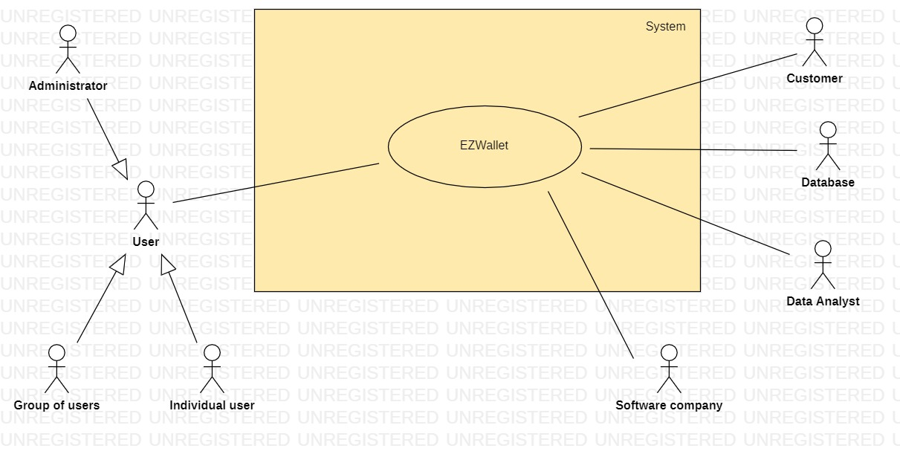
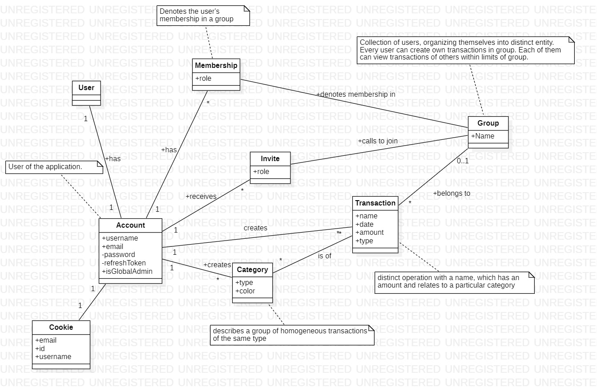
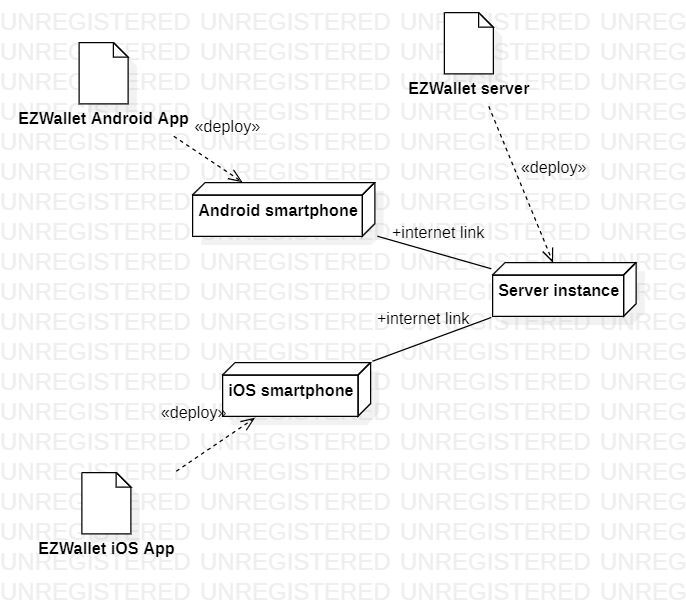

# Requirements Document - future EZWallet

Date: 

Version: V2 - description of EZWallet in FUTURE form (as proposed by the team)

 
| Version number | Change |
| ----------------- |:-----------|
| V2.1 | Final version: 28/04/2023 | 

# Proposed new features (in more or less this order)

- delete category
- delete account
- support admin features
- make app more secure
  - allowing only to see your own transactions
  - getUsers can only be called by EZWallet admin (global admin privilege)
  - getUserByUsername can return any user only if caller has global admin privilege
- recurring transactions
  
- new feature: create groups with more than one member:
  - users with different rights (admin of group, regular member)
  - group creation
  - group update
  - group deletion
  - adding / removing users from the group
  - adding / removing / updating transactions in the group

# Contents

- [Requirements Document - future EZWallet](#requirements-document---future-ezwallet)
- [Proposed new features (in more or less this order)](#proposed-new-features-in-more-or-less-this-order)
- [Contents](#contents)
- [Informal description](#informal-description)
- [Business model](#business-model)
- [Stakeholders](#stakeholders)
- [Context Diagram and interfaces](#context-diagram-and-interfaces)
	- [Context Diagram](#context-diagram)
	- [Interfaces](#interfaces)
- [Stories and personas](#stories-and-personas)
	- [Persona 1: Group of friends, low income](#persona-1-group-of-friends-low-income)
	- [Persona 2: Single male/female, 21, low income, maybe student.](#persona-2-single-malefemale-21-low-income-maybe-student)
	- [Persona 3: Young couple, low-to-middle income.](#persona-3-young-couple-low-to-middle-income)
	- [Persona 4: Married couple, without children, middle class.](#persona-4-married-couple-without-children-middle-class)
	- [Persona 5: Married couple, middle class, with young child(ren).](#persona-5-married-couple-middle-class-with-young-children)
	- [Persona 6: Married couple, middle class, with older child(ren).](#persona-6-married-couple-middle-class-with-older-children)
	- [Persona 7: Pensioner, married, low-income, with children](#persona-7-pensioner-married-low-income-with-children)
	- [Persona 8: EZWallet administrator](#persona-8-ezwallet-administrator)
	- [Persona 9: EZWallet data analyst](#persona-9-ezwallet-data-analyst)
- [Functional and non functional requirements](#functional-and-non-functional-requirements)
	- [Functional Requirements](#functional-requirements)
	- [Non Functional Requirements](#non-functional-requirements)
- [Use case diagram and use cases](#use-case-diagram-and-use-cases)
	- [Use case diagram](#use-case-diagram)
	- [Use cases](#use-cases)
		- [Use case 1 - Register](#use-case-1---register)
				- [Scenario 1.1 - Everything is correct](#scenario-11---everything-is-correct)
				- [Scenario 1.2 - User is already existing](#scenario-12---user-is-already-existing)
		- [Use case 2 - Login](#use-case-2---login)
				- [Scenario 2.1 - Everything is correct](#scenario-21---everything-is-correct)
				- [Scenario 2.2 - Account is not existing](#scenario-22---account-is-not-existing)
				- [Scenario 2.3 - Password is incorrect](#scenario-23---password-is-incorrect)
				- [Scenario 2.4 - already logged in](#scenario-24---already-logged-in)
		- [Use case 3 - Logout](#use-case-3---logout)
				- [Scenario 3.1 - Everything is correct](#scenario-31---everything-is-correct)
				- [Scenario 3.2 - User is already logged out](#scenario-32---user-is-already-logged-out)
				- [Scenario 3.3 - User is invalid](#scenario-33---user-is-invalid)
		- [Use case 4 - Get users](#use-case-4---get-users)
				- [Scenario 4.1 - Everything is correct](#scenario-41---everything-is-correct)
				- [Scenario 4.2 - User does not have global admin privilege](#scenario-42---user-does-not-have-global-admin-privilege)
				- [Scenario 4.3 - Error in querying the database](#scenario-43---error-in-querying-the-database)
		- [Use case 5 - Get users by username](#use-case-5---get-users-by-username)
				- [Scenario 5.1 - User details are returned](#scenario-51---user-details-are-returned)
				- [Scenario 5.2 - User is not logged in](#scenario-52---user-is-not-logged-in)
				- [Scenario 5.3 - User is not found](#scenario-53---user-is-not-found)
				- [Scenario 5.4 - User without global admin privilege looks for another user](#scenario-54---user-without-global-admin-privilege-looks-for-another-user)
				- [Scenario 5.5 - User with global admin privilege looks for another user](#scenario-55---user-with-global-admin-privilege-looks-for-another-user)
		- [Use case 6 - Create categories](#use-case-6---create-categories)
				- [Scenario 6.1 - Everything is correct](#scenario-61---everything-is-correct)
				- [Scenario 6.2 - User is not authorized](#scenario-62---user-is-not-authorized)
				- [Scenario 6.3 - Invalid data is entered](#scenario-63---invalid-data-is-entered)
		- [Use case 7 - Get categories](#use-case-7---get-categories)
				- [Scenario 7.1 - Everything is correct](#scenario-71---everything-is-correct)
				- [Scenario 7.2 - User is not authorized](#scenario-72---user-is-not-authorized)
		- [Use case 8 - Create new transaction](#use-case-8---create-new-transaction)
				- [Scenario 8.1 - Everything is correct, no categories added, recurring transaction checkbox is NOT selected](#scenario-81---everything-is-correct-no-categories-added-recurring-transaction-checkbox-is-not-selected)
				- [Scenario 8.2 - Everything is correct, category/ies added, recurring transaction checkbox is NOT selected](#scenario-82---everything-is-correct-categoryies-added-recurring-transaction-checkbox-is-not-selected)
				- [Scenario 8.3 - User is not authorized](#scenario-83---user-is-not-authorized)
				- [Scenario 8.4 - Name is left out](#scenario-84---name-is-left-out)
				- [Scenario 8.5 - Incorrect amount is entered](#scenario-85---incorrect-amount-is-entered)
				- [Scenario 8.6 - Everything is correct, no categories added and recurring transaction checkbox is selected](#scenario-86---everything-is-correct-no-categories-added-and-recurring-transaction-checkbox-is-selected)
				- [Scenario 8.7 - Everything is correct, category/ies added, recurring transaction checkbox is selected](#scenario-87---everything-is-correct-categoryies-added-recurring-transaction-checkbox-is-selected)
				- [Scenario 8.8 - Recurring transaction checkbox is selected, frequency selection combobox is left out](#scenario-88---recurring-transaction-checkbox-is-selected-frequency-selection-combobox-is-left-out)
		- [Use case 9 - Get transaction](#use-case-9---get-transaction)
				- [Scenario 9.1 - Everything is correct](#scenario-91---everything-is-correct)
				- [Scenario 9.2 - Everything is correct, BUT there are no transactions made, yet](#scenario-92---everything-is-correct-but-there-are-no-transactions-made-yet)
				- [Scenario 9.3 - User is not authorized](#scenario-93---user-is-not-authorized)
		- [Use case 10 - Delete transaction by id](#use-case-10---delete-transaction-by-id)
				- [Scenario 10.1 - Everything is correct, deleted transaction is NOT a recurring transaction](#scenario-101---everything-is-correct-deleted-transaction-is-not-a-recurring-transaction)
				- [Scenario 10.2 - Everything is correct, deleted transaction is a recurring transaction](#scenario-102---everything-is-correct-deleted-transaction-is-a-recurring-transaction)
				- [Scenario 10.3 - User is not authorized](#scenario-103---user-is-not-authorized)
		- [Use case 11 - Get all transactions](#use-case-11---get-all-transactions)
				- [Scenario 11.1 - Everything is correct](#scenario-111---everything-is-correct)
				- [Scenario 11.2 - User is not authorized](#scenario-112---user-is-not-authorized)
				- [Scenario 11.3 - Error while retrieving data](#scenario-113---error-while-retrieving-data)
		- [Use case 12 - Get labeled transactions](#use-case-12---get-labeled-transactions)
				- [Scenario 12.1 - Everything is correct](#scenario-121---everything-is-correct)
				- [Scenario 12.2 - Transaction is bound to non-existing type](#scenario-122---transaction-is-bound-to-non-existing-type)
		- [Use case 13 - Create new group](#use-case-13---create-new-group)
				- [Scenario 13.1 - Everything is correct](#scenario-131---everything-is-correct)
				- [Scenario 13.2 - User is unauthorized](#scenario-132---user-is-unauthorized)
		- [Use case 14 - Get group by id](#use-case-14---get-group-by-id)
				- [Scenario 14.1 - Everything is correct](#scenario-141---everything-is-correct)
				- [Scenario 14.2 - Group does not exist](#scenario-142---group-does-not-exist)
				- [Scenario 14.3 - User is not a member of the group](#scenario-143---user-is-not-a-member-of-the-group)
		- [Use case 15 - Leave group](#use-case-15---leave-group)
				- [Scenario 15.1 - Everything is correct, user is not owner of the group](#scenario-151---everything-is-correct-user-is-not-owner-of-the-group)
				- [Scenario 15.2 - User is owner of group](#scenario-152---user-is-owner-of-group)
				- [Scenario 15.3 - User is not a member of the group](#scenario-153---user-is-not-a-member-of-the-group)
		- [Use case 16 - Send invite to user](#use-case-16---send-invite-to-user)
				- [Scenario 16.1 - Everything is correct](#scenario-161---everything-is-correct)
				- [Scenario 16.2 - Invite already exists](#scenario-162---invite-already-exists)
				- [Scenario 16.3 - User is not admin](#scenario-163---user-is-not-admin)
				- [Scenario 16.4 - User does not exist](#scenario-164---user-does-not-exist)
				- [Scenario 16.5 - User is already a member](#scenario-165---user-is-already-a-member)
				- [Scenario 16.6 - Wrong email entered (empty or invalid)](#scenario-166---wrong-email-entered-empty-or-invalid)
				- [Scenario 16.7 - Wrong role selected (empty or non-existing)](#scenario-167---wrong-role-selected-empty-or-non-existing)
		- [Use case 17 - Remove user from group](#use-case-17---remove-user-from-group)
				- [Scenario 17.1 - Everything is correct](#scenario-171---everything-is-correct)
				- [Scenario 17.2 - Target user is owner](#scenario-172---target-user-is-owner)
				- [Scenario 17.3 - Target user is not a member](#scenario-173---target-user-is-not-a-member)
				- [Scenario 17.4 - User is trying to remove himself](#scenario-174---user-is-trying-to-remove-himself)
		- [Use case 18 - Change user's role in group](#use-case-18---change-users-role-in-group)
				- [Scenario 18.1 - Everything is correct](#scenario-181---everything-is-correct)
				- [Scenario 18.2 - Target user not found](#scenario-182---target-user-not-found)
				- [Scenario 18.3 - Target user is not a member](#scenario-183---target-user-is-not-a-member)
				- [Scenario 18.4 - User is not admin](#scenario-184---user-is-not-admin)
				- [Scenario 18.5 - Target user is the group owner](#scenario-185---target-user-is-the-group-owner)
		- [Use case 19 - Get list of pending invites](#use-case-19---get-list-of-pending-invites)
				- [Scenario 19.1 - Everything is correct](#scenario-191---everything-is-correct)
		- [Use case 20 - Reject invite](#use-case-20---reject-invite)
				- [Scenario 20.1 - Everything is correct](#scenario-201---everything-is-correct)
				- [Scenario 20.2 - User is not the invitee](#scenario-202---user-is-not-the-invitee)
				- [Scenario 20.3 - Invite not found](#scenario-203---invite-not-found)
		- [Use case 21 - Accept invite](#use-case-21---accept-invite)
				- [Scenario 21.1 - Everything is correct](#scenario-211---everything-is-correct)
				- [Scenario 21.2 - User is not the invitee](#scenario-212---user-is-not-the-invitee)
				- [Scenario 21.3 - Invite not found](#scenario-213---invite-not-found)
		- [Use case 22 - Delete group](#use-case-22---delete-group)
				- [Scenario 22.1 - Everything is correct, user is owner](#scenario-221---everything-is-correct-user-is-owner)
				- [Scenario 22.2 - User is not owner](#scenario-222---user-is-not-owner)
		- [Use case 23 - Rename group](#use-case-23---rename-group)
				- [Scenario 23.1 - Everything is correct](#scenario-231---everything-is-correct)
				- [Scenario 23.2 - Name validation failed](#scenario-232---name-validation-failed)
				- [Scenario 23.3 - User is not admin](#scenario-233---user-is-not-admin)
		- [Use case 24 - Create group transaction](#use-case-24---create-group-transaction)
				- [Scenario 24.1 - Everything is correct](#scenario-241---everything-is-correct)
				- [Scenario 24.2 - Amount validation failed](#scenario-242---amount-validation-failed)
				- [Scenario 24.3 - Name validation failed](#scenario-243---name-validation-failed)
		- [Use case 25 - Get group transactions](#use-case-25---get-group-transactions)
				- [Scenario 25.1 - Everything is correct](#scenario-251---everything-is-correct)
				- [Scenario 25.2 - No transactions in group](#scenario-252---no-transactions-in-group)
		- [Use case 26 - Delete group transaction](#use-case-26---delete-group-transaction)
				- [Scenario 26.1 - Everything is correct](#scenario-261---everything-is-correct)
				- [Scenario 26.2 - User tries to delete someone else's transaction](#scenario-262---user-tries-to-delete-someone-elses-transaction)
		- [Use case 27 - Delete category by id](#use-case-27---delete-category-by-id)
				- [Scenario 27.1 - Everything is correct](#scenario-271---everything-is-correct)
				- [Scenario 27.2 - User is not authorized](#scenario-272---user-is-not-authorized)
		- [Use case 28 - Delete user account](#use-case-28---delete-user-account)
				- [Scenario 28.1 - Everything is correct](#scenario-281---everything-is-correct)
				- [Scenario 28.2 - User is not authorized](#scenario-282---user-is-not-authorized)
- [Glossary](#glossary)
- [System Design](#system-design)
- [Deployment Diagram](#deployment-diagram)
- [Defects:](#defects)

# Informal description
EZWallet (read EaSy Wallet) is a software application designed to help individuals and families keep track of their expenses. Users can enter and categorize their expenses, allowing them to quickly see where their money is going. EZWallet is a powerful tool for those looking to take control of their finances and make informed decisions about their spending.

# Business model
The original application was taken as an open-source project from the internet.

The current application is a product that is developed for a customer as a commercial tool. The customer hired us (the software company) to develop the application.

# Stakeholders

| Stakeholder name  | Description | 
| ----------------- |:-----------:|
| Software company | The company responsible for developing the software |
| Customer         | The buyer of the application for whom we develop |
| Individual user | Single individual using the application |
| EZWallet Developer | Person or group of people in the development team responsible for the development of EZWallet |
| EZWallet marketing member | Person or group of people at the customer's side who are responsible for the marketing of the product |
| Product/Project manager/management | They make the strategical decisions about the product, like new feature requests, problems to handle etc. |
| Quality assurance team | Group of people responsible for testing the application |
| EZWallet analytics member | Person or group of people in analytics team responsible for EZWallet's analytics data and charts | 
| EZWallet Data Analyst | Graphical User Interface of application | 
| EZWallet Administrator | Application administrator - manages users of the system |
| Competitor | Other companies that develop a similar tool |
| Group of users (household/family/friends) | Group of individuals using the application together in group manner |

# Context Diagram and interfaces

## Context Diagram
<!-- \<Define here Context diagram using UML use case diagram> -->
<!-- \<actors are a subset of stakeholders> -->

## Interfaces
<!-- \<describe here each interface in the context diagram> -->
<!-- \<GUIs will be described graphically in a separate document> -->

| Actor | Logical Interface | Physical Interface  |
| ------------- |:-------------:| -----:|
| Individual user | Graphical User Interface of mobile application | Touchscreen, touch |
| Database | Web services | Internet |
| Group of users | Graphical User Interface of mobile application | Touchscreen, touch |
| EZWallet Administrator | Graphical User Interface of web application | Screen, keyboard, mouse |
| Software company | Web services, Development IDE | Internet, keyboard, mouse |

# Stories and personas
<!-- \<A Persona is a realistic impersonation of an actor. Define here a few personas and describe in plain text how a persona interacts with the system> -->
<!-- \<Persona is-an-instance-of actor> -->

## Persona 1: Group of friends, low income
- Story: Going on a trip together, want to keep track of all the expenses to split equally later on, or just reflect on the total amount spent by the end of the journey.
They need to have a separate group in the application where they can track expenses.
At the end of their trip they want to see the final report split by each person's spending.
Add expenses frequently for a short period of time, 2-3 weeks. Need to have a report ready any time.
## Persona 2: Single male/female, 21, low income, maybe student.
- Story: Separated from family and started to live alone. Low income, therefore wants to keep note of expenses and see the report at the end of every month, so she could understand which categories make up the most expenses.
Adds expenses regularly, on a daily basis. Needs the report mostly at the end of the month.
## Persona 3: Young couple, low-to-middle income.
- Story: Just moved in together, getting used to living together and splitting bills. Need to see visualized report at the end of the month with split by category/person. Need to see how much they spent individually so they can keep a defined balance between
each other.
Add expenses regularly, on a daily basis.
## Persona 4: Married couple, without children, middle class.
- Story: Living together for a while, focused on their careers and their income. Starting to think about the future, retirement plans, children's university money, and decide to start tracking expenses.
Having high workload and active lifestyle, they're just getting used to using the app, sometimes forget to track expenses in the app.
## Persona 5: Married couple, middle class, with young child(ren).
- Story: Having the need to take care of child(ren), who have a lot of extra-curricular activities and recurring payments the family
decides to use the app to keep track of the expenses and to be able to plan ahead, knowing the recurring spending and the budget
needed for the child(ren).
## Persona 6: Married couple, middle class, with older child(ren).
- Story: Older child just got her first phone, parents would like to instill a habit of saving and keeping track of resources, so they install the application and add her to the group, where they can view their transactions.
Adds expenses from time to time, depending on whether she has pocket money available.
## Persona 7: Pensioner, married, low-income, with children
- Story: Having a strict income of monthly pension, the pensioner's child decides to show them the application. The app can help them keep track of their expenses and to be able to plan ahead with their income. Having an insight to their parents' financial situation the child can also help them out, in case they are in need. 
Since they are from an older generation they usually have some problems of logging the expenses correctly, or forgetting to log the expenses.
## Persona 8: EZWallet administrator
- Story: As the administrator of the application, they would like to get complete access to the database so that they can make CRUD updates on the users and their data.
## Persona 9: EZWallet data analyst
- Story: as a data analyst they would like to access the user data anonymously so that they can analyze it, to deduct meaningful information. With this information they are able to suggest new features and modifications to the project management.

<!-- \<stories will be formalized later as scenarios in use cases> -->

# Functional and non functional requirements

## Functional Requirements

NOTES: 
1. Any mention of user having a role "admin" implies having a membership as well.
2. Any note like "user being an admin" means user having a role "admin" in the group.

\<In the form DO SOMETHING, or VERB NOUN, describe high level capabilities of the system>

\<they match to high level use cases>

| ID        | Description  |
| ------------- |:-------------:|
|  FR1     | "register"  |
|  FR1.1   | When the credentials are not equal to others already existing the function "register" is responsible for creating a new account and saving the data in the database. The function should return a status message with code "200" and the message "user added successfully". |
|  FR1.2   | When the credentials are equal to others already existing the function "register" is responsible for returning the status code "400" and displaying the message "you are already registered" on the screen. |
|  FR2     | "login"  |
|  FR2.1   | When the user is already logged in the function "login" is responsible for displaying an error message with the status code "200" and message "you are already logged in" on the screen. |
|  FR2.2   | When the user does not exist the function "login" is responsible for displaying an error message with the status code "400" and message "please you need to register" on the screen. |
|  FR2.3   | When the user uses wrong credentials the function "login" is responsible for displaying an error message with the status code "400" and message "wrong credentials" on the screen. |
|  FR2.4   | When the user inserts the correct credentials the function "login" is responsible for granting access to the application and to handle the token. |
|  FR3     | "logout"  |
|  FR3.1   | When the user is already logged out the function "logout" is responsible for returning an error message with the status code "200" and displaying the message "you are already logged out" on the screen. |
|  FR3.2   | When the user is not found in the database the function "logout" is responsible for returning the status code "200" and displaying the message "user not found" on the screen. |
|  FR3.3   | When the user is correctly logged in the function "logout" is responsible for managing the tokens and to properly executing the log out. The function should return the status code "200" and displaying the message "logged out" on the screen. " |
|  FR4     | "getUsers"  |
|  FR4.1   | When the user has global admin (not group admin) privilege, the function "getUsers" is responsible for finding all users in the database and returning it with status code "200". |
|  FR4.2   | When the user DOES NOT have global admin (not group admin) privilege, the function "getUsers" is responsible for returning the status code "401" and message "Not authorized". |
|  FR5     | "getUserByUsername"  |
|  FR5.1   | When the user's access token or refresh token is invalid (user is NOT Authorized) the function "getUserByUsername" is responsible for returning with status code "401" and displaying the message "Unauthorized" on the screen. It should not complete the request. |
|  FR5.2   | When the requesting user's (who is calling the function) resfeshtoken is not associated to any user in the database it should return the status code "401" and should display the message "User not found" on the screen. |
|  FR5.3   | When the requesting user does NOT have global admin privilege and the user's (who is calling the function) username is NOT equal to the username that is found in the database with the token sent in the request, the function should return the status code "401" and should display the message "Unauthorized" on the screen. |
|  FR5.4   | When the requesting user does NOT have global admin privilege BUT the user's (who is calling the function) username is equal to the username that is found in the database with the refresh token sent in the request, the function should return the status code "200" and should return the found user. |
|  FR5.5   | When the requesting user does have global admin privilege, the function 'getUserByUsername is responsible for returning status code "200" and returning the user (if it exists), regardless whether the username requested is its own or not. |
|  FR6     | "refreshToken"  |
|  FR6.1   | When the user's token is invalid the function "refreshToken" is responsible for returning the status code "401" and displaying the message "Unauthorized" on the screen. | 
|  FR6.2   | When the user's token is valid the function "refreshToken" is responsible for updating the specific token. |
|  FR7     | "create_Categories"  |
|  FR7.1   | When the user's access token is valid (user is authorized), the function "create_Categories" is responsible for creating a new category for the user with a given "type" and "color", saving it in the database and returning the data with the status code "200". |
|  FR7.2   | When the user's accesstoken is invalid the function "create_Categories" is responsible for returning the status code "401" and displaying the message "Unauthorized on the screen. It should not complete request. |
|  FR8     | "get_Categories"  |
|  FR8.1   | When the user's access token is valid (user is authorized), the function "get_Categories" is responsible for finding and listing all categories with their "type" and "color". |
|  FR8.2   | When the user's access token is invalid (user is NOT Authorized) the function "get_Categories" is responsible returning the status code "401" and displaying the message "Unauthorized" on the screen and it should not complete the request. |
|  FR9     | "create_transaction"  |
|  FR9.1   | When the user's access token is valid (user is authorized), the function "create_transaction" is responsible for saving a new transaction to the database with a given 'name', 'amount', 'type' that are specified by the user and the current 'date'. It should return the status code "400".  |
|  FR9.2   | When the user's access token is valid (user is authorized), the function "create_transaction" is responsible for saving a new transaction to the database with a given 'name', 'amount', 'type' and in case of the recurring transaction with a given frequency that are specified by the user and the current 'date'. |
|  FR9.3   | When the user's access token is invalid (user is NOT Authorized) the function "create_transaction" is responsible for returning the status code "401" with the message "Unauthorized". It should not complete the request. |
|  FR10    | "get_transaction"  |
|  FR10.1  | When the user's accesstoken is valid  (user is authorized), the function "get_transaction" is responsible for finding and returning ONLY the transactions belonging to that specific user. |
|  FR10.2  | When the user's access token is invalid (user is NOT Authorized) the function "get_transaction" is responsible returning the status code "401" and the message "Unauthorized". It should not complete the request. |
|  FR11    | "delete_transaction"  |
|  FR11.1  | When the user accesstoken is valid (user is authorized), the function "delete_transaction" is responsible for deleting a transaction with a given 'ID' that is specified in the body of the request and returning the message "deleted" upon completion. |
|  FR11.2  | When the user accesstoken is valid (user is authorized), the function "delete_transaction" is responsible for deleting a recurring transaction with a given 'ID' that is specified in the body of the request, notifying the system to cancel recurring, and returning the message "deleted" upon completion. |
|  FR11.3  | When the user's accesstoken is invalid (user is NOT Authorized) the function "delete_transaction" is responsible for returning the status code "401" and the message "Unauthorized". It should not complete the request. |
|  FR12    | "get_labels"  |
|  FR12.1  | When the user's accesstoken is valid (user is Authorized), the function "get_labels" is responsible for finding and listing all transactions with their details from a given optional category. |
|  FR12.2  | When the user's accesstoken is valid (user is Authorized) AND the function is unable to map or assign the request, it is responsible for setting the status to the status code "400". |
|  FR12.3  | When the user's access token is invalid (user is NOT Authorized) the function "get_labels" is responsible for returning the status code "401" and message "Unauthorized". It should not complete the request. |
|  FR13    | Create new group  |
|  FR13.1  | Authorized users should be able to create an empty group with one member - themselves. Just created group should be returned. |
|  FR13.2  | When user is not authorized, group creation should fail with status 401. |
|  FR14    | Get group by id |
|  FR14.1  | Authorized user, who is a member of given group, should be able to retrieve information about the group with a given ID. Group name and members list should be returned, alongside with the transactions associated with the given group.  |
|  FR14.2 | When there is no group with given ID, status 404 should be returned to client without any info. |
|  FR14.3 | When group exists, but requesting user is not a member of it, status 403 should be returned with message "You cannot access this group".  |
|  FR15    | Leave group |
|  FR15.1  | Authorized user, a member of given group, who is not a creator of group, should be removed from members of this group. All their transactions in this group should be permanently removed. |
|  FR15.2  | Authorized user, who is a creator of group, should not be removed from the group. Instead, status 409 should be returned and a message "You cannot leave your own group" |
|  FR15.3 | When user is not a member of given group, status 403 should be returned and no other actions executed, message "You are not a member of this group, you cannot leave it". |
|  FR16    | Send invite to user |
|  FR16.1  | Authorized user, who has a role "admin" in given group, should be able to send invite to user with given email. A new pending invite should be created in database for given user and given group. Request returns status 201 and new Invite. |
|  FR16.2  | When there is already pending invite for a given user-group pair, no new invitation should be created. Instead, the request should return status 409 and message "This user is already invited" |
|  FR16.3  | When requesting user does not have a role "admin" in this group, status 403 should be returned and no other actions executed. |
|  FR16.4  | When invitee with such email does not exist in database, status 404 should be returned with message "User not found" |
|  FR17    | Remove user from group |
|  FR17.1  | Authorized user, who has a role "admin" in given group, should be able to remove user with given ID from the group members. User removal flow should be used from FR15.1  |
|  FR17.2  | When requesting the removal of a user but the user performing the action doesn't have role "admin" in this group, status 403 should be returned and no other actions executed. |
|  FR17.3  | When trying to remove themselves, status 409 should be returned. |
|  FR17.4  | When trying to remove group owner, status 409 should be returned. |
|  FR18    | Change user's role in group |
|  FR18.1  | Authorized user, who has a role "admin" in given group, and if target user is not a creator of the group, then this request should change other user's role to the one given in request. Allowed roles are "member", "admin".  |
|  FR18.2  | When requester doesn't have "admin" role, status 403 should be returned and nothing more done. |
|  FR18.3  | When given user is not a member of given group, status 409 should be returned. |
|  FR18.4  | When given user is group owner, and all other constraints are satisfies, status 409 should be returned with message "You cannot alter creator's role" |
|  FR19 | Get list of pending invites |
|  FR19.1  | Authorized user should be able to fetch list of pending group invitations.  |
|  FR20 | Reject invite |
|  FR20.1 | Authorized user should be able to reject invite with given ID. This invite should be removed from database. |
|  FR20.2 | If this invite's target user is not the same as user making the request, status 403 should be returned. |
|  FR20.3 | If invite with such ID does not exist, status 404 should be returned. |
|  FR21 | Accept invite |
|  FR21.1 | Authorized user should be able to accept the invitation with given ID. Invite should be removed from database, and user should be added to list of members for this group. |
|  FR21.2 | If this invite's target user is not the same as user making the request, status 403 should be returned. |
|  FR21.3 | If invite with such ID does not exist, status 404 should be returned. |
|  FR22 | Delete group |
|  FR22.1 | Authorized user with role "admin", who is also the creator of given group, should be able to permanently delete this group. When group is deleted, all  memberships should be deleted from the database, as well as all the transactions. |
|  FR22.2 | When requesting user is not the creator of the group, status 403 should be returned and message "You are not owner" |
|  FR23 | Rename group |
|  FR23.1 | Authorized member user with role "admin" should be able to change group's name. |
|  FR23.2 | When user doesn't have "admin" role, status 403 should be returned. |
|  FR23.3 | When name length is more than limit allowed by database, status 400 should be returned and message "Name too long" |
|  FR24 | Create group transaction |
|  FR24.1 | Authorized user, who is a member of a given group, should be able to create transaction bound to that group. This route should reuse logic from FR9, with addition of setting 'groupId' to group ID provided in request. |
|  FR24.2 | When authorized user isn't member of group, status 403 should be returned with message "You are not a member of the group". |
|  FR24.3 | When group with such ID does not exist, status 404 should be returned with message "Group not found" |
|  FR25 | Get group transactions |
|  FR25.1 | Authorized user, who is a member of a given group, should be able to get all transactions belonging to given group in descending order (by date of creation). This route should reuse logic from FR10, with addition of respecting groupId parameter to filter out transactions. |
|  FR25.2 | When authorized user isn't member of group, status 403 should be returned with message "You are not a member of the group". |
|  FR25.3 | When group with such ID does not exist, status 404 should be returned with message "Group not found" |
|  FR26 | Delete group transaction |
|  FR26.1 | Authorized user, who is a member of a given group, should be able to delete their transaction by given id from group. Transaction should stay in database, but 'groupId' set to null. |
|  FR26.2 | When transaction doesn't belong to user, status 404 should be returned with message "Transaction not found", in order not to expose other user's transactions status. |
|  FR27    | "delete_category"  |
|  FR27.1  | When the user's accesstoken is valid (user is authorized), the function "delete_category" is responsible for deleting a category with a given 'type' that is specified in the body of the request and returning the message "deleted category" upon completion. |
|  FR27.2  | When the user's accesstoken is invalid (user is NOT Authorized) the function "delete_category" is responsible for returning the status code "401" and the message "Unauthorized". It should not complete the request. |
|  FR28    | "delete_account"  |
|  FR28.1  | When the user's accesstoken is valid (user is authorized), the function "delete_account" is responsible for deleting a the account associated to the accesstoken being used and returning the message "deleted category" upon completion. |
|  FR28.2  | When the user's accesstoken is invalid (user is NOT Authorized) the function "delete_account" is responsible for returning the status code "401" and the message "Unauthorized". It should not complete the request. |
## Non Functional Requirements

\<Describe constraints on functional requirements>

<!-- e.g. async function to improve performance -->
<!--
	- Usability: effort needed to learn the product
	- Efficiency: response time
	- Correctness capability provide intended functionality
	- reliability: defects visible by end user per time
	- maintainability: effort to fix
	- portability: effort for deploy to another platform
	- Security: protection of malicious access / only to authorized
	- Safety: absence of harm   
-->

| ID        | Type (efficiency, reliability, ..)           | Description  | Refers to |
| ------------- |:-------------:| :-----:| -----:|
|  NFR1     | Efficiency | The functions mentioned in the referenced requirements must work asynchronously to increase efficiency and performance. | FR1-FR12, FR13, FR14-FR28 |
| NFR2 | Reliability | The functions mentioned in the referenced requirements should use a try-catch block to increase reliability. In case of an error they should return the status code "500" and the error message. | FR1, FR2, FR3, FR4, FR5, FR13, FR17, FR19, FR22, FR26, FR27, FR28|
| NFR3 | Security | The functions mentioned in the referenced requirements should use encryption to protect user data. | FR2 |
| NFR3 | Security | The user's password should be hashed. Only the hashed value may be stored in the database. | FR1, FR2 |
| NFR3 | Usability | The application should use an accessToken that stores the user's credentials to ease the use of the application. It should be used to verify the identity of the user to avoid unauthorized accesses to data. The accessToken is valid for 1 hour from creation. When the user is logs out it is destroyed. | FR1-FR28 |
| NFR4 | Usability | The application should use a refreshToken that can be used to create new accessToken to enable continuous usage of the application. | FR1-FR28 |

# Use case diagram and use cases

## Use case diagram
<!-- \<define here UML Use case diagram UCD summarizing all use cases, and their relationships> -->

\<next describe here each use case in the UCD>

<!-- \<describe here scenarios instances of UC1> -->
<!-- \<a scenario is a sequence of steps that corresponds to a particular execution of one use case> -->
<!-- \<a scenario is a more formal description of a story> -->
<!-- \<only relevant scenarios should be described> -->

## Use cases

Note: the database is an actor that is included in every use case, hence we decided to omit putting it to every description.
Note: DB stands for database

<!-- USE CASES FOR END USERS -->

### Use case 1 - Register
| Actors Involved        | User |
| ------------- |:-------------:| 
|  Precondition     | User has no account |
|  Post condition     | User has an account  |
|  Nominal Scenario     | New account is created and saved in backend |
|  Variants     | None |
|  Exceptions     | User is already existing |

##### Scenario 1.1 - Everything is correct
| Scenario 1.1 | |
| ------------- |:-------------:| 
|  Precondition     | User has no account |
|  Post condition     | User has an account |
| Step#        | Description  |
|  1     | User asks to register |  
|  2     | System asks username, e-mail, password (user is not already registered) |
|  3     | System hashes the password |
|  4     | System saves the new account |

##### Scenario 1.2 - User is already existing
| Scenario 1.2 | |
| ------------- |:-------------:| 
|  Precondition     | User is already existing |
|  Post condition     | Error message is returned, the account is not created |
| Step#        | Description  |
|  1     | User asks to register |  
|  2     | System asks username, e-mail, password |
|  3     | Request fails with status code "400" |
|  4     | The error message is returned to the user |

### Use case 2 - Login
| Actors Involved        | User |
| ------------- |:-------------:| 
|  Precondition     | User has an account |
|  Post condition     | User is logged in |
|  Nominal Scenario     | Everything is correct |
|  Variants       | None                        |
|  Exceptions     | Already logged in, Account is not existing, Password is incorrect |

##### Scenario 2.1 - Everything is correct
| Scenario 2.1 | |
| ------------- |:-------------:| 
|  Precondition     | User has an account |
|  Post condition     | User is logged in |
| Step#        | Description  |
|  1     | User asks to login |  
|  2     | System asks e-mail, password |
|  3     | User enters e-mail, password |
|  4     | System checks that access token is valid |  
|  5     | System checks that credentials are correct   |
|  6     | System authorizes the user and handles the token |
|  7     | System returns status code "200" |

##### Scenario 2.2 - Account is not existing
| Scenario 2.2 | |
| ------------- |:-------------:| 
|  Precondition     | Entered e-mail is not existing |
|  Post condition     | User is not logged in |
| Step#        | Description  |
|  1     | User asks to login |  
|  2     | System asks e-mail, password |
|  3     | User enters e-mail, password |
|  4     | System checks database, finds no user with the given e-mail address |
|  5     | System returns status code "400" and message 'please you need to register' |

##### Scenario 2.3 - Password is incorrect
| Scenario 2.3 | |
| ------------- |:-------------:| 
|  Precondition     | Inserted password is not correct |
|  Post condition     | User is not logged in |
| Step#        | Description  |
|  1     | User asks to login |  
|  2     | System asks e-mail, password |
|  3     | User enters e-mail, password |
|  4     | System checks that credentials, that are not correct |
|  5     | System returns status code "400" and message 'wrong credentials' |

##### Scenario 2.4 - already logged in
| Scenario 2.4 | |
| ------------- |:-------------:| 
|  Precondition     | User is already logged in |
|  Post condition     | User acknowledges he/she is already authenticated |
| Step#        | Description  |
|  1     | User asks to login |  
|  2     | System asks e-mail, password |
|  3     | User enters e-mail, password |
|  4     | System checks that accessToken is valid | 
|  5     | System returns status code "200" and message 'you are already logged in' |

### Use case 3 - Logout
| Actors Involved        | User |
| ------------- |:-------------:| 
|  Precondition     | User is logged in |
|  Post condition     | User is logged out  |
|  Nominal Scenario     | User is properly logged out |
|  Variants     | None |
|  Exceptions     | User is already logged out, User is invalid |

##### Scenario 3.1 - Everything is correct
| Scenario 3.1 | |
| ------------- |:-------------:| 
|  Precondition     | User is logged in |
|  Post condition     | User is logged out  |
| Step#        | Description  |
|  1     | User asks system to log out |  
|  2     | System checks token |
|  3     | System checks user's validity |
|  4     | System logs the user out, responds with status code "200" and message 'logged out' |

##### Scenario 3.2 - User is already logged out
| Scenario 3.2 | |
| ------------- |:-------------:| 
|  Precondition     | User is already logged out |
|  Post condition     | Error message is returned |
| Step#        | Description  |
|  1     | User asks the system to log out |  
|  2     | System checks that token is not valid |
|  3     | Request fails with status code "200" |
|  4     | The message "you are already logged out" is returned |

##### Scenario 3.3 - User is invalid 
| Scenario 3.3 | |
| ------------- |:-------------:| 
|  Precondition     | User is not in the database |
|  Post condition     | Error message is returned |
| Step#        | Description  |
|  1     | User asks the system to log out |  
|  2     | System checks token |
|  3     | System checks user, who is not found in the database |
|  4     | Request fails with status code "400" |
|  5     | The message "user not found" is returned to the user |

### Use case 4 - Get users
| Actors Involved        | User, EZWallet Administrator |
| ------------- |:-------------:| 
|  Precondition     | |
|  Post condition     | The list is properly returned  |
|  Nominal Scenario     | The list is retrieved from database |
|  Variants     | None  |
|  Exceptions     | Error in querying the database |

##### Scenario 4.1 - Everything is correct
| Scenario 4.1 | |
| ------------- |:-------------:| 
|  Precondition     | User has global admin privilege |
|  Post condition     | The list is properly returned  |
| Step#        | Description  |
|  1     | User with global admin privilege asks the system for a list of all users |  
|  2     | System queries the database and retrieves the list with status code "200". |

##### Scenario 4.2 - User does not have global admin privilege
| Scenario 4.2 | |
| ------------- |:-------------:| 
|  Precondition     | User does not have global admin privilege |
|  Post condition     | Error message is displayed to the user  |
| Step#        | Description  |
|  1     | User without global admin privilege asks the system for a list of all users |  
|  2     | System checks privilege level |
|  3     | System returns status code "401" and message "Not authorized". |
##### Scenario 4.3 - Error in querying the database
| Scenario 4.3 | |
| ------------- |:-------------:| 
|  Precondition     |  |
|  Post condition     | Error message is returned  |
| Step#        | Description  |
|  1     | User asks the system for a list of all users |  
|  2     | System queries the database and request fails |
|  3     | The status code '500' is returned with the error message |

### Use case 5 - Get users by username
| Actors Involved        | User, EZWallet Administrator |
| ------------- |:-------------:| 
|  Precondition     | User is authenticated |
|  Post condition     | The value is properly returned and the user can continue |
|  Nominal Scenario     | User details are returned |
|  Variants     | None |
|  Exceptions     | User is not logged in, User not found, User looks for another user |

##### Scenario 5.1 - User details are returned
| Scenario 5.1 | |
| ------------- |:-------------:| 
|  Precondition     | User is authenticated |
|  Post condition     | The data is properly returned |
| Step#        | Description  |
|  1     | User asks the system for its credentials |  
|  2     | System queries the database (user is found) |
|  3     | System provides the user the specific data |
##### Scenario 5.2 - User is not logged in
| Scenario 5.2 | |
| ------------- |:-------------:| 
|  Precondition     | User is not logged in  |
|  Post condition     | Error message is returned  |
| Step#        | Description  |
|  1     | User asks the system for a specific user |  
|  2     | System queries the database, but the user is logged out |
|  3     | System returns status code "401" and message "unauthorized" |

##### Scenario 5.3 - User is not found
| Scenario 5.3 | |
| ------------- |:-------------:| 
|  Precondition     | User is logged in  |
|  Post condition     | Error message is returned  |
| Step#        | Description  |
|  1     | User asks the system for a specific user |  
|  2     | System queries the database, but the user is not found |
|  3     | System returns status code "401" and message "user not found" |

##### Scenario 5.4 - User without global admin privilege looks for another user
| Scenario 5.4 | |
| ------------- |:-------------:| 
|  Precondition     | User is logged in  |
|  Post condition     | Error message is returned  |
| Step#        | Description  |
|  1     | User asks the system for a specific user |  
|  2     | System queries the database, but the user is different from the requesting user |
|  3     | System returns status code "401" and message "unauthorized" |

##### Scenario 5.5 - User with global admin privilege looks for another user
| Scenario 5.4 | |
| ------------- |:-------------:| 
|  Precondition     | User is logged in, User has global admin privilege |
|  Post condition     | The data is properly returned  |
| Step#        | Description  |
|  1     | User asks the system for a specific user |  
|  2     | System queries the database, but the user is different from the requesting user |
|  3     | System provides the user the specific data  |

### Use case 6 - Create categories
| Actors Involved        | User |
| ------------- |:-------------:| 
|  Precondition     | User is authenticated |
|  Post condition     | New category is created and entered into the database  |
|  Nominal Scenario     | New category is created and saved in backend |
|  Variants     | Category is created while entering a transaction OR category is created separately |
|  Exceptions     | User is not authorized, Invalid data is entered |

##### Scenario 6.1 - Everything is correct
| Scenario 6.1 | |
| ------------- |:-------------:| 
|  Precondition     | User is authenticated |
|  Post condition     | New category is created and entered into the database  |
| Step#        | Description  |
|  1     | User touches the "Add new category" button |  
|  2     | User enters the details of the category |
|  2.1   | User enters the type of the category |
|  2.2   | User enters the color of the category |
|  3     | User clicks on "Save" |
|  4     | Category is entered into to user's account on backend |
|  5     | User is navigated back to the main screen |

##### Scenario 6.2 - User is not authorized
| Scenario 6.2 | |
| ------------- |:-------------:| 
|  Precondition     | User is not authorized |
|  Post condition     | Error message is returned, the category is not created |
| Step#        | Description  |
|  1     | User touches the "Add new category" button |  
|  2     | User credentials are fetched from backend |
|  3     | Request fails with status code "401" |
|  4     | The error message is returned to the user |
|  5     | User is navigated back to the main screen |

##### Scenario 6.3 - Invalid data is entered
| Scenario 6.3 | |
| ------------- |:-------------:| 
|  Precondition     | User is authorized |
|  Post condition     | Error message is returned, back to category creation page |
| Step#        | Description  |
|  1     | User touches the "Add new category" button |  
|  2     | User enters the details of the category |
|  2.1   | User DOES NOT enter data correctly |
|  3     | User clicks on "Save" |
|  4     | Request fails with status code "400" |
|  5     | Error message is returned |
|  6     | User is navigated back to the category creation page |

### Use case 7 - Get categories
| Actors Involved        | User |
| ------------- |:-------------:| 
|  Precondition     | User is authenticated |
|  Post condition     | Categories are returned on the screen |
|  Nominal Scenario     | List of existing categories is returned on the screen |
|  Variants     | None |
|  Exceptions     | User is not authorized |

##### Scenario 7.1 - Everything is correct
| Scenario 7.1 | |
| ------------- |:-------------:| 
|  Precondition     | User is authenticated |
|  Post condition     | Categories are returned on the screen |
| Step#        | Description  |
|  1     | Navigate to categories tab from side menu |  
|  2     | Fetch categories list from backend |
|  3     | Display categories list |

##### Scenario 7.2 - User is not authorized
| Scenario 7.2 | |
| ------------- |:-------------:| 
|  Precondition     | User is NOT authorized |
|  Post condition     | Error is returned to user |
| Step#        | Description  |
|  1     | Navigate to categories tab from side menu |  
|  2     | Make backend request |
|  3     | Request fails with status 401 |
|  4     | Display error to user |

### Use case 8 - Create new transaction
| Actors Involved        | User |
| ------------- |:-------------:| 
|  Precondition     | User is authenticated, user is on "Transactions" page |
|  Post condition     | New transaction is added to database |
|  Nominal Scenario     | Everything is correct |
|  Variants     | Category/ies added or not / recursive transaction is selected or not |
|  Exceptions     | User is not authorized, Invalid amount, no name entered, frequency selection combobox is left out (in case of recurring transaction) |

##### Scenario 8.1 - Everything is correct, no categories added, recurring transaction checkbox is NOT selected
| Scenario 8.1 | |
| ------------- |:-------------:| 
|  Precondition     | User is authenticated, user is on "Transactions" page |
|  Post condition     | New transaction is added to database |
| Step#        | Description  |
|  1     | User clicks "Add transaction" button |  
|  2     | Get transaction info from user |
|  2.1   | User enters name of transaction |
|  2.2   | User enters correct amount of the transaction |
|  3     | Clicks "Save transaction" |
|  4     | Send POST request to backend |
|  5     | Request is executed correctly, new transaction document is returned from backend |
|  6     | Close app screen |

##### Scenario 8.2 - Everything is correct, category/ies added, recurring transaction checkbox is NOT selected 
<!--can there be more than one category added?-->
| Scenario 8.2 | |
| ------------- |:-------------:| 
|  Precondition     | User is authenticated, user is on "Transactions" page |
|  Post condition     | New transaction is added to database |
| Step#        | Description  |
|  1     | User clicks "Add transaction" button |  
|  2     | Get transaction info from user |
|  2.1   | User enters name of transaction |
|  2.2   | User enters correct amount of the transaction |
|  2.3   | User enters category of the transaction |
|  3     | Clicks "Save transaction" |
|  4     | Send POST request to backend |
|  5     | Request is executed correctly, new transaction document is returned from backend |
|  6     | Close app screen |
##### Scenario 8.3 - User is not authorized
| Scenario 8.3 | |
| ------------- |:-------------:| 
|  Precondition     | User is NOT authorized |
|  Post condition     | Error is returned to user |
| Step#        | Description  |
|  1     | User clicks "Add transaction" button |  
|  2     | Get transaction info from user |
|  3     | Clicks "Save transaction" |
|  4     | Send POST request to backend |
|  5     | Request fails with status 401 |
|  6     | Error is returned to user |

##### Scenario 8.4 - Name is left out
| Scenario 8.4 | |
| ------------- |:-------------:| 
|  Precondition     | User is authenticated, user is on "Transactions" page |
|  Post condition     | Error is returned to the user |
| Step#        | Description  |
|  1     | User clicks "Add transaction" button |  
|  2     | Get transaction info from user |
|  2.1   | User DOES NOT enter the name of transaction |
|  3     | Clicks "Save transaction" |
|  4     | Send POST request to backend |
|  5     | Request fails due to missing transaction name |
|  6     | Error is returned to the user |

##### Scenario 8.5 - Incorrect amount is entered
| Scenario 8.5 | |
| ------------- |:-------------:| 
|  Precondition     | User is authenticated, user is on "Transactions" page |
|  Post condition     | Error is returned to the user |
| Step#        | Description  |
|  1     | User clicks "Add transaction" button |  
|  2     | Get transaction info from user |
|  2.1   | User enters INCORRECT amount for the transaction (0 or EMPTY) |
|  3     | Clicks "Save transaction" |
|  4     | Send POST request to backend |
|  5     | Request fails due to incorrect transaction amount |
|  6     | Error is returned to the user |

##### Scenario 8.6 - Everything is correct, no categories added and recurring transaction checkbox is selected
| Scenario 8.6 | |
| ------------- |:-------------:| 
|  Precondition     | User is authenticated, user is on "Transactions" page and recurring transaction checkbox is selected |
|  Post condition     | New recurring transaction is added to database |
| Step#        | Description  |
|  1     | User clicks "Add transaction" button |  
|  2     | Get transaction info from user |
|  2.1   | User enters name of transaction |
|  2.2   | User enters correct amount of the transaction |
|  2.3   | User selects the recurring transaction checkbox |
|  2.4   | System displays the frequency selection combobox |
|  2.5   | User selects the frequency of the recurring transaction (daily, weekly or monthly) |
|  3     | Clicks "Save transaction" |
|  4     | Send POST request to backend |
|  5     | Request is executed correctly, new transaction document is returned from backend |
|  6     | System returns the same transaction at every frequency that is selected by the user |
|  7     | Close app screen |

##### Scenario 8.7 - Everything is correct, category/ies added, recurring transaction checkbox is selected 
<!--can there be more than one category added?-->
| Scenario 8.7 | |
| ------------- |:-------------:| 
|  Precondition     | User is authenticated, user is on "Transactions" page, recurring transaction checkbox is selected |
|  Post condition     | New transaction is added to database and the system is notified to create the same transaction in a given frequency  |
| Step#        | Description  |
|  1     | User clicks "Add transaction" button |  
|  2     | Get transaction info from user |
|  2.1   | User enters name of transaction |
|  2.2   | User enters correct amount of the transaction |
|  2.3   | User enters category of the transaction |
|  2.3   | User selects the recurring transaction checkbox |
|  2.4   | System displays frequency selection combobox |
|  2.5   | User selects the frequency of the recurring transaction |
|  3     | Clicks "Save transaction" |
|  4     | Send POST request to backend |
|  5     | Request is executed correctly, new transaction document is returned from backend |
|  6     | System returns the same transaction at every frequency that is selected by the user |
|  7     | Close app screen |

##### Scenario 8.8 - Recurring transaction checkbox is selected, frequency selection combobox is left out

| Scenario 8.8 | |
| ------------- |:-------------:| 
|  Precondition     | User is authenticated, user is on "Transactions" page, recurring transaction checkbox is selected |
|  Post condition     | Error is displayed to the user |
| Step#        | Description  |
|  1     | User clicks "Add transaction" button |  
|  2     | Get transaction info from user |
|  2.1   | User select the recurring transaction checkbox |
|  2.2   | User DOES NOT select the frequency of the recurring transaction |
|  3     | Clicks "Save transaction" |
|  4     | Send POST request to backend |
|  5     | Request fails due to missing transaction frequency |
|  6     | Error is displayed to the user |

### Use case 9 - Get transaction
| Actors Involved        | User |
| ------------- |:-------------:| 
|  Precondition     | User is authenticated |
|  Post condition     | List of transactions is returned to user  |
|  Nominal Scenario     | User clicks on transactions tab, GET request is executed successfully, user sees transactions list |
|  Variants     | None |
|  Exceptions     | User is not authorized |
##### Scenario 9.1 - Everything is correct
| Scenario 9.1 | |
| ------------- |:-------------:| 
|  Precondition     | User is authenticated |
|  Post condition     | List of transactions is returned to user  |
| Step#        | Description  |
|  1     | Navigate to transactions tab from side menu |  
|  2     | Fetch transactions list from backend |
|  3     | Display transactions list |

##### Scenario 9.2 - Everything is correct, BUT there are no transactions made, yet
| Scenario 9.2 | |
| ------------- |:-------------:| 
|  Precondition     | User is authenticated |
|  Post condition     | Information is returned to user |
| Step#        | Description  |
|  1     | Navigate to transactions tab from side menu |  
|  2     | Fetch transactions list from backend |
|  3     | There are no transactions made, yet |
|  4     | Display information that there are no transactions made, yet |

##### Scenario 9.3 - User is not authorized
| Scenario 9.3 | |
| ------------- |:-------------:| 
|  Precondition     | User is NOT authorized |
|  Post condition     | Error is returned to user |
| Step#        | Description  |
|  1     | Navigate to transactions tab from side menu |  
|  2     | Make backend request |
|  3     | Request fails with status 401 |
|  4     | Display error to user |

### Use case 10 - Delete transaction by id
| Actors Involved        | User |
| ------------- |:-------------:| 
|  Precondition     | User is authenticated and authorized, user is on "Transactions" page |
|  Post condition     | Transaction is removed from database and from user's screen |
|  Nominal Scenario     | Everything is correct |
|  Variants     | Deleted transaction is a recurring transaction or not |
|  Exceptions     | User is not authorized |

##### Scenario 10.1 - Everything is correct, deleted transaction is NOT a recurring transaction 
| Scenario 10.1 | |
| ------------- |:-------------:| 
|  Precondition     | User is authenticated and authorized, user is on "Transactions" page |
|  Post condition     | Transaction is removed from database and from user's screen |
| Step#        | Description  |
|  1     | Click delete button |
|  2     | Send request to backend with transaction id |
|  3     | Delete transaction from database by id |
|  4     | Finish request with status 200 and response "deleted" |
|  5     | Transaction is removed from app screen |

##### Scenario 10.2 - Everything is correct, deleted transaction is a recurring transaction 
| Scenario 10.2 | |
| ------------- |:-------------:| 
|  Precondition     | User is authenticated, user is on "Transactions" page, transaction is recurring |
|  Post condition     | Transaction is removed from database and from user's screen, system is notified to cancel further recurring |
| Step#        | Description  |
|  1     | User clicks delete button |
|  2     | System sends request to backend with transaction id |
|  3     | System deletes transaction from database by id |
|  4     | System cancels further recurring |
|  5     | System finishes request with status 200 and response "deleted" |
|  6     | System removes transaction from app screen |

##### Scenario 10.3 - User is not authorized
| Scenario 10.3 | |
| ------------- |:-------------:| 
|  Precondition     | User is NOT authenticated or NOT authorized |
|  Post condition     | Error is returned to user |
| Step#        | Description  |
|  1     | Click delete button |
|  2     | User's authentication is checked and it fails (accessToken is not valid) |
|  3     | Request fails with status 401 |
|  4     | Error is returned to user |

### Use case 11 - Get all transactions
<!-- is this implemented by the get labels function? -->
| Actors Involved        | User |
| ------------- |:-------------:| 
|  Precondition     | User is authenticated, user is on "Transactions" page |
|  Post condition     | All transactions are returned |
|  Nominal Scenario     | Everything is correct |
|  Variants     | |
|  Exceptions     | User is not authorized |

##### Scenario 11.1 - Everything is correct
| Scenario 11.1 | |
| ------------- |:-------------:| 
|  Precondition     | User is authenticated, user is on "Transactions" page |
|  Post condition     | All transactions are returned |
| Step#        | Description  |
|  1     | Navigate to transactions tab from side menu |  
|  2     | Fetch transactions list from backend |
|  3     | Display transactions list |

##### Scenario 11.2 - User is not authorized
| Scenario 11.2 | |
| ------------- |:-------------:| 
|  Precondition     | User is NOT authorized |
|  Post condition     | Error is returned to user |
| Step#        | Description  |
|  1     | Navigate to transactions tab from side menu |  
|  2     | Fetch transactions list from backend |
|  3     | Request fails with status 401 |
|  4     | Error is returned to user |

##### Scenario 11.3 - Error while retrieving data
| Scenario 11.3 | |
| ------------- |:-------------:| 
|  Precondition     | User is authenticated, user is on "Transactions" page |
|  Post condition     | Error message is returned |
| Step#        | Description  |
|  1     | Navigate to transactions tab from side menu |  
|  2     | Fetch transactions list from backend |
|  3     | Object assignment or mapping fails with status 400 |
|  4     | Error is returned to user |

### Use case 12 - Get labeled transactions
| Actors Involved        | User |
| ------------- |:-------------:| 
|  Precondition     | User is authenticated |
|  Post condition     | List of categories with total spending is shown to user |
|  Nominal Scenario     | Everything is correct |
|  Variants     | Transaction is bound to non-existing type |
|  Exceptions     | User is not authorized |

##### Scenario 12.1 - Everything is correct
| Scenario 12.1 | |
| ------------- |:-------------:| 
|  Precondition     | User is authenticated |
|  Post condition     | List of categories with total spending is shown to user |
| Step#        | Description  |
|  1     | User navigates to "labels" tab from side menu |  
|  2     | Fetch labeled transactions list from backend |
|  3     | Aggregation query is executed, joining transactions with categories by type, unwinding categories |
|  4     | Array is returned with status 200 |
|  5     | Display pie chart from this data grouped by types  |

##### Scenario 12.2 - Transaction is bound to non-existing type
| Scenario 12.2 | |
| ------------- |:-------------:| 
|  Precondition     | User is authenticated |
|  Post condition     | List of categories with total spending is shown to user, but new transaction is not included in target category |
| Step#        | Description  |
|  1     | Create new transaction in non-existing category |  
|  2     | User navigates to "" tab from side menu |  
|  3-6   | Same as scenario 3.1 |
|  7     | Data should not include transaction created in step 1 |
|  8     | Display pie chart from the data returned |

### Use case 13 - Create new group
| Actors Involved        | User |
| ------------- |:-------------:| 
|  Precondition     | User is authenticated |
|  Post condition     | New group is created and updated list of groups is shown to user |
|  Nominal Scenario     | Everything is correct |
|  Variants     | |
|  Exceptions     | User is not authorized |

##### Scenario 13.1 - Everything is correct
| Scenario 13.1 | |
| ------------- |:-------------:| 
|  Precondition     | User is authenticated |
|  Post condition     | New group is created and updated list of groups is shown to user |
| Step#        | Description  |
|  1     | User navigates to "Groups" tab from side menu |  
|  2     | Fetch list of groups they're in as a member |
|  3     | Request returns list of groups, status is 200 |
|  4     | User clicks "Create new group" |
|  5     | Group form opens, where user enters group name |
|  6     | User submits the form using "Save" button |
|  7     | POST request to backend is issued |
|  8     | Request is executed correctly, new group is inserted to database, user is added as the only member with "admin" role. User is set to be group's owner. |
|  9     | Navigation goes back to groups list |
|  10    | Updated list is fetched from backend |
|  11     | Display updated list of groups |

##### Scenario 13.2 - User is unauthorized
| Scenario 13.1 | |
| ------------- |:-------------:| 
|  Precondition     | User is NOT authorized |
|  Post condition   | Error is returned to user |
| Step#  | Description  |
|  1-2     | Same as in [SC13.1](#scenario-131---everything-is-correct) |  
|  3     | Request fails with status 401 |
|  4     | Display error to user |

### Use case 14 - Get group by id
| Actors Involved        | User |
| ------------- |:-------------:| 
|  Precondition     | User is authenticated, user is on "Groups" screen |
|  Post condition     | Navigation to "Group" screen is completed |
|  Nominal Scenario     | Everything is correct |
|  Variants     | |
|  Exceptions     | Group does not exist, group is not accessible for user |

##### Scenario 14.1 - Everything is correct
| Scenario 14.1 | |
| ------------- |:-------------:| 
|  Precondition     | [UC14](#use-case-14---get-group-by-id) |
|  Post condition     | Navigation to "Group" screen occurs and group is shown |
| Step#        | Description  |
|  1     | User clicks on group item in the list |  
|  2     | Backend GET request is made |
|  3     | Request returns info on that group - name, members list and associated transactions. Status 200 |
|  4     | Navigation jumps to "Group" screen with info received from backend |
|  5     | Group info is shown to user |

##### Scenario 14.2 - Group does not exist
| Scenario 14.2 | |
| ------------- |:-------------:| 
|  Precondition     | [UC14](#use-case-14---get-group-by-id); Group deleted after list was fetched |
|  Post condition     | Message is displayed to user, group is removed from local list |
| Step#        | Description  |
|  1     | User clicks on group item in the list |  
|  2     | Backend GET request is made |
|  3     | Group is not found in DB, request fails with 404 and message "Group not found" |
|  4     | Group is removed from local list |
|  5     | Show error notification  |

##### Scenario 14.3 - User is not a member of the group
| Scenario 14.3 | |
| ------------- |:-------------:| 
|  Precondition     | [UC14](#use-case-14---get-group-by-id); User was removed from group after list was fetched |
|  Post condition     | Message is displayed to user, group is removed from local list |
| Step#        | Description  |
|  1     | User clicks on group item in the list |  
|  2     | Backend GET request is made |
|  3     | User membership is not found, request fails with 403 and message "You cannot access this group" |
|  4     | Group is removed from local list |
|  5     | Show error notification  |

### Use case 15 - Leave group
| Actors Involved        | User |
| ------------- |:-------------:| 
|  Precondition     | User is a member of the group, user is on "Groups" screen |
|  Post condition     | User is not in the group anymore, user is on "Groups" screen |
|  Nominal Scenario     | Everything is correct, user is not owner of group |
|  Variants     | User is owner OR user is not owner of the group |
|  Exceptions     | User is not a member of the group |

##### Scenario 15.1 - Everything is correct, user is not owner of the group
| Scenario 15.1 | |
| ------------- |:-------------:| 
|  Precondition     | [UC15](#use-case-15---leave-group) |
|  Post condition     | User is not in group anymore, user is on "Groups" screen |
| Step#        | Description  |
|  1     | User clicks on a group |
|  2     | Navigate to group screen |
|  3     | User clicks "Leave group" button |
|  4     | Backend POST request is made |
|  5     | User membership is deleted from DB, all user's transactions bound to group are removed too. |
|  6     | Request resolves with status 200. |
|  7     | Group is removed from local list  |
|  8     | Navigate to "Groups" screen |

##### Scenario 15.2 - User is owner of group
| Scenario 15.2 | |
| ------------- |:-------------:| 
|  Precondition     | [UC15](#use-case-15---leave-group); User is the owner of group |
|  Post condition     | Error is displayed to user |
| Step#        | Description  |
|  1     | Steps 1-4 of [S15.1](#scenario-151---everything-is-correct-user-is-not-owner-of-the-group) |
|  5     | User is owner of the group, request ends with status 409 and message "You cannot leave your own group" |
|  6     | Error is displayed to user |

##### Scenario 15.3 - User is not a member of the group
| Scenario 15.2 | |
| ------------- |:-------------:| 
|  Precondition     | [UC15](#use-case-15---leave-group); User is not a member of the group |
|  Post condition     | Error is displayed to user |
| Step#        | Description  |
|  1     | Steps 1-4 of [S15.1](#scenario-151---everything-is-correct-user-is-not-owner-of-the-group) |
|  5     | Membership for user is not found for the given group in DB, request fails with status 403 and message "You are not a member of this group" |
|  6     | Error is displayed to user |

### Use case 16 - Send invite to user
| Actors Involved        | User |
| ------------- |:-------------:| 
|  Precondition     | User is on group screen, User has role "admin" in group |
|  Post condition     | Other user is invited to group, success message is displayed |
|  Nominal Scenario     | Everything is correct |
|  Variants     | |
|  Exceptions     | User already invited, user isn't found, user's already a member, sender is not "admin" |

##### Scenario 16.1 - Everything is correct
| Scenario 16.1 | |
| ------------- |:-------------:| 
|  Precondition     | [UC16](#use-case-16---send-invite-to-user) |
|  Post condition     | Other user is invited to group, success message is displayed |
| Step#        | Description  |
|  1     | User clicks "Invite user" button |
|  2     | Modal window is opened |
|  3     | User enters user email, selects role |
|  4     | User submits the form using "Invite user" button |
|  5     | POST request is issued with given email, role, and group ID |
|  6     | Invite is inserted into DB |
|  7     | Request resolves with status 201, invite is sent in body |
|  8     | Success message "Invite sent" is displayed |

##### Scenario 16.2 - Invite already exists
| Scenario 16.2 | |
| ------------- |:-------------:| 
|  Precondition     | [UC16](#use-case-16---send-invite-to-user) |
|  Post condition     | Error is displayed to user |
| Step#        | Description  |
|  1     | [S16.1](#scenario-161---everything-is-correct) steps 1-5 |
|  6     | Invite already exists in the database, request returns status 409 and message "This user is already invited" |
|  7     | Message is displayed to sender user |

##### Scenario 16.3 - User is not admin
| Scenario 16.3 | |
| ------------- |:-------------:| 
|  Precondition     | [UC16](#use-case-16---send-invite-to-user) |
|  Post condition     | Error is displayed to user |
| Step#        | Description  |
|  1     | [S16.1](#scenario-161---everything-is-correct) steps 1-5 |
|  6     | User doesn't have "admin" role, request fails with status 403 |
|  7     | Error is displayed to user |

##### Scenario 16.4 - User does not exist
| Scenario 16.4 | |
| ------------- |:-------------:| 
|  Precondition     | [UC16](#use-case-16---send-invite-to-user) |
|  Post condition     | Error is displayed to user |
| Step#        | Description  |
|  1     | [S16.1](#scenario-161---everything-is-correct) steps 1-5 |
|  2     | User with such email is not found in DB, request fails with status 404 and message "User not found" |
|  3     | Error is displayed to user |

##### Scenario 16.5 - User is already a member
| Scenario 16.5 | |
| ------------- |:-------------:| 
|  Precondition     | [UC16](#use-case-16---send-invite-to-user) |
|  Post condition     | Error is displayed to user |
| Step#        | Description  |
|  1     | [S16.1](#scenario-161---everything-is-correct) steps 1-5 |
|  2     | Invitee is already a member, so request fails with status 409 |
|  3     | Error is displayed to user |

##### Scenario 16.6 - Wrong email entered (empty or invalid)
| Scenario 16.6 | |
| ------------- |:-------------:| 
|  Precondition     | [UC16](#use-case-16---send-invite-to-user) |
|  Post condition     | Error is displayed to user |
| Step#        | Description  |
|  1     | [S16.1](#scenario-161---everything-is-correct) steps 1-2 |
|  2     | User enters invalid email and somehow bypasses client-side validation |
|  3     | [S16.1](#scenario-161---everything-is-correct) step 4-5 |
|  4     | Backend validation fails, response status is 400 with message "Invalid email"   |
|  5     | Error is displayed to user |

##### Scenario 16.7 - Wrong role selected (empty or non-existing)
| Scenario 16.7 | |
| ------------- |:-------------:| 
|  Precondition     | [UC16](#use-case-16---send-invite-to-user) |
|  Post condition     | Error is displayed to user |
| Step#        | Description  |
|  1-2     | [S16.1](#scenario-161---everything-is-correct) steps 1-2 |
|  3     | User enters invalid role and bypasses client-side validation |
|  4-5     | [S16.1](#scenario-161---everything-is-correct) step 4-5 |
|  6     | Backend validation fails, response status is 400 with message "Invalid role"   |
|  7     | Error is displayed to user |

### Use case 17 - Remove user from group
| Actors Involved        | User |
| ------------- |:-------------:| 
|  Precondition     | User is admin of the group, user is on "Group" screen |
|  Post condition     | Removed user is not a member anymore |
|  Nominal Scenario     | Everything is correct |
|  Variants     | |
|  Exceptions     | User is not a member, User is owner, Trying to remove oneself |

##### Scenario 17.1 - Everything is correct
| Scenario 17.1 | |
| ------------- |:-------------:| 
|  Precondition     | [UC17](#use-case-17---remove-user-from-group) |
|  Post condition     | Removed user is not a member anymore |
| Step#        | Description  |
|  1     | User clicks on other user on screen |
|  2     | User modal is opened |
|  3     | User clicks "remove user" button |
|  4-6   | [Scenario 15.1](#scenario-151---everything-is-correct-user-is-not-owner-of-the-group) steps 4-6 |
|  7     | Everything is OK, user is removed from local list |
|  8     | Success message is shown to user |

##### Scenario 17.2 - Target user is owner
| Scenario 17.2 | |
| ------------- |:-------------:| 
|  Precondition     | [UC17](#use-case-17---remove-user-from-group) |
|  Post condition     | Error is displayed to user |
| Step#        | Description  |
|  1     | User somehow calls the method on group owner |
|  2     | Backend request is made |
|  3     | Target user is owner, request fails with status 409 and message "Cannot remove owner from the group" |
|  4     | Error is shown to user |

##### Scenario 17.3 - Target user is not a member
| Scenario 17.3 | |
| ------------- |:-------------:| 
|  Precondition     |  |
|  Post condition     | Error is displayed to user |
| Step#        | Description  |
|  1     | User somehow calls the method on any user |
|  2     | Backend request is made |
|  3     | Target user is not a member, request fails with status 409 and message "User is not a member" |
|  4     | Error is shown to user |

##### Scenario 17.4 - User is trying to remove himself
| Scenario 17.4 | |
| ------------- |:-------------:| 
|  Precondition     | [UC17](#use-case-17---remove-user-from-group) |
|  Post condition     | Error is displayed to user |
| Step#        | Description  |
|  1     | User calls the method with their own ID |
|  2     | Backend request is made |
|  3     | Request fails with status 405 and message "Cannot remove yourself from the group" |
|  4     | Error is shown to user |

### Use case 18 - Change user's role in group
| Actors Involved        | User |
| ------------- |:-------------:| 
|  Precondition     | User is admin of the group, user is on "Group" screen |
|  Post condition     | Target user role is changed |
|  Nominal Scenario     | Everything is correct |
|  Variants     | |
|  Exceptions     | Target user is not found; target user is not a member; user is not an admin; target user is owner of the group |

##### Scenario 18.1 - Everything is correct
| Scenario 18.1 | |
| ------------- |:-------------:| 
|  Precondition     | [UC18](#use-case-18---change-users-role-in-group) |
|  Post condition     | User's role is changed, success message is displayed |
| Step#        | Description  |
|  1     | User clicks on other user on screen |
|  2     | User modal is opened |
|  3     | User selects role different from the one user currently has |
|  4     | User clicks "Save" |
|  5     | POST backend request is issued with given user, group ID, and the new role |
|  6     | User role is updated in DB, request resolves with status 200 |
|  7     | Success message is displayed to user |

##### Scenario 18.2 - Target user not found
| Scenario 18.2 | |
| ------------- |:-------------:| 
|  Precondition     | [UC18](#use-case-18---change-users-role-in-group) |
|  Post condition     | Error message is displayed to user |
| Step#        | Description  |
|  1-5     | [S18.1](#scenario-181---everything-is-correct) steps 1-5 |
|  6     | User is not found in the database |
|  7     | Request fails with status 404 and message "User not found" |
|  8     | Error message is displayed to user |

##### Scenario 18.3 - Target user is not a member
| Scenario 18.3 | |
| ------------- |:-------------:| 
|  Precondition     | [UC18](#use-case-18---change-users-role-in-group) |
|  Post condition     | Error message is displayed to user |
| Step#        | Description  |
|  1     | Somehow user calls the method on an arbitrary user |
|  2     | User does not have a membership in the group |
|  3     | Request fails with status 409 and message "User is not a member" |
|  4     | Error message is displayed to user |

##### Scenario 18.4 - User is not admin
| Scenario 18.4 | |
| ------------- |:-------------:| 
|  Precondition     | |
|  Post condition     | Error message is displayed to user |
| Step#        | Description  |
|  1     | User calls the method while not being an admin |
|  2     | User is not an "admin" in the group, request fails with status 403 and message "Insufficient rights" |
| 3      | Error message is displayed to user |

##### Scenario 18.5 - Target user is the group owner
| Scenario 18.5 | |
| ------------- |:-------------:| 
|  Precondition     | [UC18](#use-case-18---change-users-role-in-group) |
|  Post condition     | Error message is displayed to user |
| Step#        | Description  |
|  1     | User calls the method with user ID being group owner ID  |
|  2     | Since target user is owner, request fails with status 409 and message "Cannot alter owner's role" |
| 3      | Error message is displayed to user |

### Use case 19 - Get list of pending invites
| Actors Involved        | User |
| ------------- |:-------------:| 
|  Precondition     | User is authenticated |
|  Post condition     | List of pending group invites is displayed |
|  Nominal Scenario     | Everything is correct |
|  Variants     | |
|  Exceptions     | |

##### Scenario 19.1 - Everything is correct
| Scenario 19.1 | |
| ------------- |:-------------:| 
|  Precondition     | [UC19](#use-case-19---get-list-of-pending-invites) |
|  Post condition     | [UC19](#use-case-19---get-list-of-pending-invites) |
| Step#        | Description  |
|  1     | User navigates to "Pending invites" |
|  2     | GET request is issued |
|  3     | List of all invites pertaining to caller is returned from DB with status 200  |
|  4     | List of invites is displayed to user |

### Use case 20 - Reject invite
| Actors Involved        | User |
| ------------- |:-------------:| 
|  Precondition     | User is on "invites" screen |
|  Post condition     | Invite deleted and removed from the list |
|  Nominal Scenario     | Everything is correct |
|  Variants     | |
|  Exceptions     | User is not the invitee, invite not found |

##### Scenario 20.1 - Everything is correct
| Scenario 20.1 | |
| ------------- |:-------------:| 
|  Precondition     | [UC20](#use-case-20---reject-invite) |
|  Post condition     | [UC20](#use-case-20---reject-invite) |
| Step#        | Description  |
|  1     | User clicks on one of the pending invites. |
|  2     | Modal window opens with 2 options: "Accept" and "Reject" |
|  3     | User clicks "Reject" |
|  4     | POST request to backend is issued with invite ID |
|  5     | Invite is deleted from DB and request ends with status 200 |
|  6     | Invite is removed from local list |

##### Scenario 20.2 - User is not the invitee
| Scenario 20.2 | |
| ------------- |:-------------:| 
|  Precondition     | [UC20](#use-case-20---reject-invite) |
|  Post condition     | Error is displayed to user, invite stays intact |
| Step#        | Description  |
|  1-4     | [S20.1](#scenario-201---everything-is-correct) steps 1-4 |
|  5     | Invite target user does not match caller ID, request fails with status 403 and message "Cannot reject invite" |
|  6     | Error displayed to user |

##### Scenario 20.3 - Invite not found
| Scenario 20.3 | |
| ------------- |:-------------:| 
|  Precondition     | [UC20](#use-case-20---reject-invite) |
|  Post condition     | Error is displayed to user, invite stays intact |
| Step#        | Description  |
|  1     | User calls method with some non-existent invite ID |
|  2     | Invite not found in DB, request rejects with status 404 and message "Invite not found" |
|  3     | Error displayed to user |

### Use case 21 - Accept invite
| Actors Involved        | User |
| ------------- |:-------------:| 
|  Precondition     | User is on "invites" screen |
|  Post condition     | Invite deleted and removed from the list, user added to group |
|  Nominal Scenario     | Everything is correct |
|  Variants     | |
|  Exceptions     | User is not the invitee, invite not found |

##### Scenario 21.1 - Everything is correct
| Scenario 21.1 | |
| ------------- |:-------------:| 
|  Precondition     | [UC21](#use-case-21---accept-invite) |
|  Post condition     | [UC21](#use-case-21---accept-invite) |
| Step#        | Description  |
|  1-2     | [S20.1](#scenario-201---everything-is-correct) steps 1-2 |
|  3     | User clicks "Accept" |
|  4     | POST request to backend is issued with invite ID |
|  5     | Invite is deleted from DB, user is added to group members with the role specified in invite entity, and request ends with status 200 |
|  6     | Invite is removed from local list |

##### Scenario 21.2 - User is not the invitee
| Scenario 21.2 | |
| ------------- |:-------------:| 
|  Precondition     | [UC21](#use-case-21---accept-invite) |
|  Post condition     | Error is displayed to user, invite stays intact |
| Step#        | Description  |
|  1-3     | [S21.1](#scenario-211---everything-is-correct) steps 1-3 |
|  4     | Invite target user does not match caller ID, request fails with status 403 and message "Cannot accept invite" |
|  5     | Error displayed to user |

##### Scenario 21.3 - Invite not found
| Scenario 21.3 | |
| ------------- |:-------------:| 
|  Precondition     | [UC21](#use-case-21---accept-invite) |
|  Post condition     | Error is displayed to user, invite stays intact |
| Step#        | Description  |
|  1     | User calls method with some non-existent invite ID |
|  2     | Invite not found in DB, request rejects with status 404 and message "Invite not found" |
|  3     | Error displayed to user |

### Use case 22 - Delete group
| Actors Involved        | User |
| ------------- |:-------------:| 
|  Precondition     | User is authenticated |
|  Post condition     | Group is permanently removed |
|  Nominal Scenario     | Everything is correct |
|  Variants     | |
|  Exceptions     | User is not owner, group is not found |

##### Scenario 22.1 - Everything is correct, user is owner
| Scenario 22.1 | |
| ------------- |:-------------:| 
|  Precondition     | User is authenticated; User is owner |
|  Post condition     | Group is permanently removed |
| Step#        | Description  |
|  1     | User navigates to a particular group |
|  2     | User clicks "Delete group" button |
|  3     | POST request is issued with group ID |
|  4     | Group is deleted, all memberships are deleted, all invites to group are deleted, all transactions in that group are deleted. Request resolves with status 200 |
|  5     | Navigate to "Groups" screen |

##### Scenario 22.2 - User is not owner
| Scenario 22.2 | |
| ------------- |:-------------:| 
|  Precondition     | User is authenticated; User is member, but not the owner |
|  Post condition     | Error is shown to user |
| Step#        | Description  |
|  1-3     | [S22.1](#scenario-221---everything-is-correct-user-is-owner) steps 1-3 |
|  4     | User is not owner, request ends with status 403 and message "You are not  owner" |
|  5     | Error is shown to user |

### Use case 23 - Rename group
| Actors Involved        | User |
| ------------- |:-------------:| 
|  Precondition     | User is authenticated |
|  Post condition     | Group name is changed, name is updated on the client |
|  Nominal Scenario     | Everything is correct |
|  Variants     | |
|  Exceptions     | User is not admin, name validation failed |

##### Scenario 23.1 - Everything is correct
| Scenario 23.1 | |
| ------------- |:-------------:| 
|  Precondition     | User is authenticated; User is admin |
|  Post condition     | [UC23](#use-case-23---rename-group) |
| Step#        | Description  |
|  1     | User navigates to a particular group |
|  2     | User clicks "Rename group" button |
|  3     | Modal window is opened with a field with group's current name as value  |
|  4     | User alters the name |
|  5     | User submits the form with "Save" button |
|  6     | POST request is executed with given name and group ID |
|  7     | Group name is updated in the database, updated group data is returned with status 200 |
|  8     | Group name is updated on the screen, modal closes. |

##### Scenario 23.2 - Name validation failed
| Scenario 23.2 | |
| ------------- |:-------------:| 
|  Precondition     | [UC23](#use-case-23---rename-group) |
|  Post condition     | Error is shown to user |
| Step#        | Description  |
|  1-4     | [S23.1](#scenario-231---everything-is-correct) steps 1-4 |
|  5     | User bypasses client validation and submits request |
|  6     | Backend validation fails, returns status 400 and message "Name is too short/long" |
|  7     | Error is shown to user |

##### Scenario 23.3 - User is not admin
| Scenario 23.3 | |
| ------------- |:-------------:| 
|  Precondition     | [UC23](#use-case-23---rename-group) |
|  Post condition     | Error is shown to user |
| Step#        | Description  |
|  1-6     | [S23.1](#scenario-231---everything-is-correct) steps 1-6 |
|  7     | User is not admin in the group, request fails with status 403 |
|  8     | Error is shown to user |

### Use case 24 - Create group transaction
| Actors Involved        | User |
| ------------- |:-------------:| 
|  Precondition     | User is authenticated; user is a member of the group; user is on group transactions screen |
|  Post condition     | Transaction is created and added to group transactions list |
|  Nominal Scenario     | Everything is correct |
|  Variants     | |
|  Exceptions     | User is not a member, group does not exist, amount validation failed, name validation failed |

##### Scenario 24.1 - Everything is correct
| Scenario 24.1 | |
| ------------- |:-------------:| 
|  Precondition     | [UC24](#use-case-24---create-group-transaction) |
|  Post condition     | [UC24](#use-case-24---create-group-transaction) |
| Step#        | Description  |
|  1     | User clicks "Add transaction" button |  
|  2     | Modal window opens |  
|  3     | User enters transaction name |
|  4     | User enters transaction amount |
|  5     | User picks category |
|  6     | User clicks "Save transaction" |
|  7     | Send POST request to backend with all the info +  group ID. Using same request as in [SC8.1](#scenario-81---everything-is-correct-no-categories-added-recursive-transaction-checkbox-is-not-selected) |
|  8     | Request is executed correctly, transaction is saved to backend and returned with status 200 |
|  9     | Modal window closes |
|  10     | Transaction is added on the top of the list |

##### Scenario 24.2 - Amount validation failed
| Scenario 24.2 | |
| ------------- |:-------------:| 
|  Precondition     | [UC24](#use-case-24---create-group-transaction) |
|  Post condition     | Error is displayed to user |
| Step#        | Description  |
|  1-7     | [S24.1](#scenario-241---everything-is-correct) steps 1-7 |  
|  8     | User somehow bypasses client validation |  
|  9     | Payload validation fails on field "amount". Error is returned and status 400 |  
|  10     | Error is shown to user |

##### Scenario 24.3 - Name validation failed
| Scenario 24.3 | |
| ------------- |:-------------:| 
|  Precondition     | [UC24](#use-case-24---create-group-transaction) |
|  Post condition     | Error is displayed to user |
| Step#        | Description  |
|  1-7     | [S24.1](#scenario-241---everything-is-correct) steps 1-7 | 
|  8     | User somehow bypasses client validation |
|  9     | Payload validation fails on field "name". Error is returned and status 400 |  
|  10     | Error is shown to user |

### Use case 25 - Get group transactions
| Actors Involved        | User |
| ------------- |:-------------:| 
|  Precondition     | User is authenticated; user is part of the group; user is on "Groups" screen |
|  Post condition     | Transactions list is displayed to user |
|  Nominal Scenario     | Everything is correct |
|  Variants     | No transactions in the group |
|  Exceptions     | |

##### Scenario 25.1 - Everything is correct
| Scenario 25.1 | |
| ------------- |:-------------:| 
|  Precondition     | [UC25](#use-case-25---get-group-transactions) |
|  Post condition     | [UC25](#use-case-25---get-group-transactions) |
| Step#        | Description  |
|  1     | User clicks on a group |  
|  2     | App navigates to group screen |  
|  3     | GET request is issued with group ID. Using same request as in [S9.1](#scenario-91---everything-is-correct) |
|  4     | All transactions pertaining to that group are returned in descending order. Response status is 200  |
|  5     | List of transactions is displayed with all info along with category color and category name |

##### Scenario 25.2 - No transactions in group
| Scenario 25.2 | |
| ------------- |:-------------:| 
|  Precondition     | [UC25](#use-case-25---get-group-transactions) |
|  Post condition     | "No transactions" text is rendered |
| Step#        | Description  |
|  1-4     | [S25.1](#scenario-251---everything-is-correct) steps 1-4 |  
|  5     | Empty list is returned with status 200 |  
|  6     | "No transactions" text is rendered on screen |

### Use case 26 - Delete group transaction
| Actors Involved        | User |
| ------------- |:-------------:| 
|  Precondition     | User is authenticated; user is part of the group; user is on group transactions screen |
|  Post condition     | Transaction is removed from database and from screen |
|  Nominal Scenario     | Everything is correct |
|  Variants     | |
|  Exceptions     | User tries to delete someone else's transaction |

##### Scenario 26.1 - Everything is correct
| Scenario 26.1 | |
| ------------- |:-------------:| 
|  Precondition     | [UC26](#use-case-26---delete-group-transaction) |
|  Post condition     | [UC26](#use-case-26---delete-group-transaction) |
| Step#        | Description  |
|  1     | User selects one of their transactions to delete |  
|  2     | User confirms transaction deletion |  
|  3     | DELETE request is issued to backend with transaction ID and group ID. Using same request as in [S10.1](#scenario-101---everything-is-correct-deleted-transaction-is-not-a-recursive-transaction) |
|  4     | Transaction is removed from backend and returned to client with status 200 |
|  5     | Transaction is removed from local list |

##### Scenario 26.2 - User tries to delete someone else's transaction
| Scenario 26.2 | |
| ------------- |:-------------:| 
|  Precondition     | [UC26](#use-case-26---delete-group-transaction) |
|  Post condition     | Error is displayed to user |
| Step#        | Description  |
|  1-3     | [S26.1](#scenario-261---everything-is-correct) steps 1-3 |  
|  4     | Transaction belongs to other user, so request is ignored, status 404 and message "Transaction not found" |  
|  5     | Error is displayed to user |

### Use case 27 - Delete category by id
| Actors Involved        | User |
| ------------- |:-------------:| 
|  Precondition     | User is authenticated, user is on "Categories" page |
|  Post condition     | Category is removed from database and from user's screen |
|  Nominal Scenario     | Everything is correct |
|  Variants     | |
|  Exceptions     | User is not authorized |

##### Scenario 27.1 - Everything is correct
| Scenario 27.1 | |
| ------------- |:-------------:| 
|  Precondition     | User is authenticated, user is on "Categories" page |
|  Post condition     | Category is removed from database and from user's screen |
| Step#        | Description  |
|  1     | Click delete button |
|  2     | Send request to backend with category id |
|  3     | Delete category from database by id |
|  4     | Finish request with status 200 and response "deleted" |
|  5     | Category is removed from app screen |

##### Scenario 27.2 - User is not authorized
| Scenario 27.2 | |
| ------------- |:-------------:| 
|  Precondition     | User is NOT authorized |
|  Post condition     | Error is returned to user |
| Step#        | Description  |
|  1     | Click delete button |
|  2     | User's authentication is checked and it fails (accessToken is not valid) |
|  3     | Request fails with status 401 |
|  4     | Error is returned to user |

### Use case 28 - Delete user account
| Actors Involved        | User |
| ------------- |:-------------:| 
|  Precondition     | User is authenticated, user is on "Account" page |
|  Post condition     | Account is removed from database, user is logged out, all account data is deleted |
|  Nominal Scenario     | Everything is correct |
|  Variants     | |
|  Exceptions     | User is not authorized, error with database request |

##### Scenario 28.1 - Everything is correct
| Scenario 28.1 | |
| ------------- |:-------------:| 
|  Precondition     | User is authenticated, user is on "Account" page |
|  Post condition     | Account is removed from database, user is logged out, all account data is deleted |
| Step#        | Description  |
|  1     | Click delete button |
|  2     | Pop-up appears with prompt to confirm account deletion |
|  3     | User clicks on the button confirming the account deletion |
|  4     | Request is sent to the backend with the details of the user |
|  5     | All user data is erased from the database of the application, with the user's account itself. |
|  6     | Finish request with status 200 and response "Account deleted" |
|  7     | User is navigated back to the landing page of the app. |

##### Scenario 28.2 - User is not authorized
| Scenario 28.2 | |
| ------------- |:-------------:| 
|  Precondition     | User is NOT authorized |
|  Post condition     | Error is returned to user |
| Step#        | Description  |
|  1     | Click delete button |
|  2     | Pop-up appears with prompt to confirm account deletion |
|  3     | User clicks on the button confirming the account deletion |
|  4     | User's authentication is checked and it fails (accessToken is not valid) |
|  5     | Request fails with status 401 |
|  6     | Error is returned to user |

# Glossary
<!-- \<use UML class diagram to define important terms, or concepts in the domain of the application, and their relationships> 
\<concepts must be used consistently all over the document, ex in use cases, requirements etc> -->

# System Design
<!-- \<describe here system design> -->
<!-- \<must be consistent with Context diagram> -->

# Deployment Diagram 
<!-- \<describe here deployment diagram > -->

# Defects:

| Defect (what is wrong) | Proposed correction |
| get_labels function: the color attribute is never returned | return the color alongside with the other attributes |
| getUsers function: the function can be called by anyone right now, which implies privacy/security issues. On top of that the 'Admin' privilege is not implemented at all | Create 'Admin' user type, only admins can call this function |
| Classes in Estimation documents: the document shouldn't be counting the number of classes, but the number of modules | change classes to modules |
